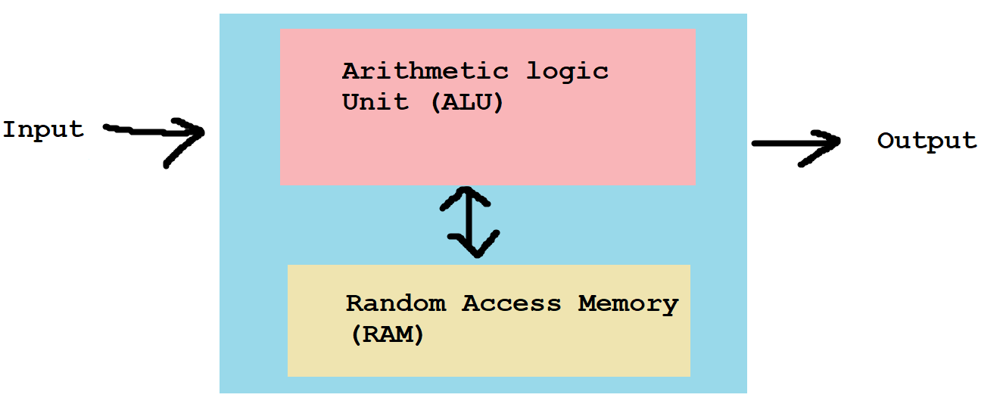

# CS2100 AY21/22 S1 C programming
## C Programming
source(C) -compiler-> Object Code(ASM) -linker-> Executable(Machine code)
Von Neumann architecture:

## Variables
  **Variables need not be initialized to 0/null**
Stores:
1. Name
2. Data type
3. Value
4. Address

Primitive C data types:
1. int (4 bytes)
2. float (4 bytes, IEEE 754 single precision)
3. double (8 bytes, IEEE 754 double precision)
4. char (1 byte)

<span style="background-color: #aa0000">NOTE</span> sizeof() is **Compile time**, so sizeof(arr[]) only works if you call it on the array itself, not in the function parameter

<span style="background-color: #aa0000">NOTE</span> character constants (e.g. 'a') is actually an int in C, but char in C++

e.g. `function(int arr[]) {return sizeof(arr);}` will not work as intended

**Other data types, e.g. boolean, are syntactic sugar** e.g. true === 1
Static typing: type explicitly declared.
### Characters
ASCII characters, represented by integers 0 - 127 (Non expanded charset)
## Pointers
```c
int a = 1;
int *b = &a;
printf("%d", *b);
```
*b declares b as a int pointer (4 byte DWORD)
&a specifies to assign the address of a (rather than the value) to b
*b later dereferences the pointer (gets the value at the address pointed)

### Incrementing pointers
```c
int *b = &a;
b++;
```
b++ increments the address stored in b by sizeof(int). Same thing for b += 1;

### Pass by

C passes by value. Use pointers/addresses to "by reference". Function parameters are passed in by value, so cannot modify outside values unless pointers provided. Function parameters stored in call stack, destroyed when function completes -- aka **Automatic Variables**

## More C stuff
**% in c refers to remainder NOT modulo!**
-11 mod 4 = (4 * 3) - 11 = 1
-11 remainder 4 = -3
### Order or operations
1. primary: `(), x++, x--`
2. urnary: `* & + - ++x --x (typecast)`
3. binary:
```
<, >, <=, >=
==, !=
&&
||
... ?... :...
```
4. assignment: `= += -= *= /= %=`

## Arrays
- Fixed size, once declared cannot grow/shrink
- Arrays cannot be reassigned
    ```c
    int[10] c = {};
    c = other_array; /*Compiler error here*/
    ```
- Pointing to an array:
    ```c
    int b[3] = {1,2,3};
    int (*c)[3] = &b;
    ```
- Taking array as parameter:
    ```c
    public void f(int arr[]) {}
    /*Or*/
    public void f(int *arr) {
      return f(arr++); /*"splices" array*/
    }
    ```
## Strings
- requires import string.h
- Basically char arrays with a '/0' char after the last character.
- Missing terminating character causes println to print forever
- use strcpy/strncpy to assign string value to a string variable.
## Structs
Format:
```c
typedef struct Custom {
  int field1;
  int field2;
  char field3;
}
Custom custom = {69, 420, 'F'};
Custom custom2 = {.field2 = 420, .field1 = 69, .field3 = 'F'};
```
- typedef can also be used for primitives, i.e. typedef unsigned char BYTE -> BYTE b1;
- Similar to class but no methods allowed.
- **Passed by value to functions**, i.e. fields are copied. Pass as pointer for modification, ie. f(Custom \*x), (\*x).field = ...

**OUT OF SYLLABUS(?)**
Unions: can hold diff data types in same address.
```c
union Data {
  int i;
  char str[20]
};

Data data;
data.i = 420;
strcpy(data.str, "20 CHARACTERS");

printf("%d", data.i);
```
- Unions are only meant to hold 1 value, in above case i is corrupted by the strcpy
- size of data = size of largest member, i.e. str[20]
