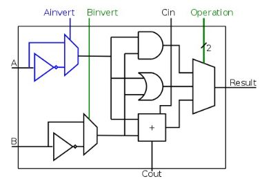

# CS2100 mid terms cheat sheet
## Bin
Converting:
1. decimal to bin: divide by 2, remainder set as MSB. 17 () -> 8(1) -> 4(01) -> 2(001) -> 1(0001) -> 10001
2. bin to hex: group by 4, convert to 16: 001000110001 -> 0010 0011 0001 -> 2 3 1 -> 0x231
MSB of **signed** int has no weight.
Fast conversion 111...: if there are 5 consecutive 1's: value = 2^**5** - 1 (5 not 6 since start from power 0)
Negatives:
<table>
<tr><th>Type</th><th>Max</th><th>Min</th><th>-0?</th><th>invert</th><th>add</th></tr>
<tr><td>Sign & Mag        </td><td>0111(2^N-1 - 1)</td><td>1111(-2^N-1 + 1)</td><td>T</td><td>flip MSB</td></tr>
<tr><td>(N-1)'s complement</td><td>0111(2^N-1 - 1)</td><td>1000(-2^N-1 + 1)</td><td>T</td><td>invert bits</td></tr>
<tr><td>N's complement</td><td>0111(2^N-1 - 1)</td><td>1000(-2^N-1)</td><td>F</td><td>invert bits + 1</td></tr>
</table>

Addition:
1. Sign & Mag: complicated
2. R-1's complement: add, if MSB has carry over add 1 -> 1100 + 0100 = [1]0000 -> 0001
3. R's complement: add, ignore MSB carry
Overflow detection: MSB changes after +1 (if both MSB same) MSB different never overflow

Floats[sign][exponent][mantissa]:
Single precision [1][8][23], Bias: 127
Double precision [1][11][52],Bias: 1023
1. Find exponent, k, s.t. input / 2^k = 1.? -> 0.085 / 2^-4 = 1.36, k = -4
2. Add bias to exponent: 127 - 4 = 123 = 01111011 -> [0][01111011]
3. Copy fractional to mantissa: 1.36 -> 01.**01011...** -> [0][01111011][01011...]

## C
C data types: int (4b 2's), float (4b, IEEE single),double (8b, IEEE double), char (1b number)
sizeof() is **Compile time**, so sizeof(arr[]) only works if you call it on the array itself
Static typing: type explicitly declared
ASCII characters, only 0 - 127
Incrementing pointer is by word, e.g. int arr a, `a++` or `a += 1` increases a by `sizeof(int)`
Function params pass by value, need pass pointer to modify outside

Order or operations
1. primary: `(), x++, x--`
2. urnary: `* & + - ++x --x (typecast)`
3. binary:
```
<, >, <=, >=
==, !=
&&
||
... ?... :...
```
4. assignment: `= += -= *= /= %=`

Arrays
- Fixed size, once declared cannot grow/shrink
- Arrays cannot be reassigned
    ```c
    int c[10] = {};
    c = other_array; /*Compiler error here*/
    // or int[10] b = c;
    ```
- Pointing to an array:
    ```c
    int b[3] = {1,2,3};
    int (*c)[3] = &b;
    ```
- Taking array as parameter:
    ```c
    public void f(int arr[]) {}
    /*Or*/
    public void f(int *arr) {
      return f(arr++); /*"splices" array*/
    }
    ```

Structs
```c
typedef struct Custom {
  int field1;
  char field2;
}
Custom custom = {69, 'F'};
Custom custom2 = {.field2 = 'F', .field1 = 69};
```
- typedef can also be used for primitives, i.e. typedef unsigned char BYTE -> BYTE b1;
- Similar to class but no methods allowed.
- **Passed by value to functions**, i.e. fields are copied. Pass as pointer for modification, ie. f(Custom \*x), (\*x).field = ...

## MIPS

Loading large constants:
1. load upper immediate, lui $t0 0x4444 --> sets first 16 bits of t0 to 0x4444, last 16 bits to 0
2. OR immediate, ori $t0, $t0, 0x2222 --> sets lower 16 bits of t0 to 0x2222, first 16 bits padded with 0 so no change.


### R-format: |opcode|rs|rt|rd|shamt|funct| > 32bits, |6|5|5|5|5|6|
- opcode: 0
- funct: combined with opcode to exactly specify instruction
- shamt: amount a shift instruction shifts. **0 in non-shift instructions**
**sll, rs is empty. source to shift is placed in rt.**
### I-format |opcode|rs|rt|immediate| > |6|5|5|16|
notice opcode, rs, rt same position
**rt taken as destination; immediate constants 16 bits 2's complement signed int, 16+ bits use r format lui/ori**
beq just put straight in, beq s1, s2, ... -> |beq|s1|s2|...|
note: \$0($s1) works: assembler sees $0 as 0, no diff
### J-format |opcode|target addr| > |6|26|
**direct addressing to memory location!**
loop: addi $s1 0 // 0xF0A...A00
      j loop     // 0xF0...
      some code  // 0xF0...
PC: 0xF0...
addr = |~~0xF0~~|**0xA...A**|~~0x00~~| = *0xA...A*
- if PC+4 has very different 4 MSB from target addr, error can occur (jump too far).

*Examples*
> [R] add $s0, $s1, $s2 -> |0|\$s1|\$s2|\$s0|0|add_funct|
> 
> [R] sll $8, $9, 4 -> |0|0|9|8|4|sll_funct|
> 
> [I] addi $21, $22, -50 -> |addi|22|21|-50|
> 
> [I] lw $9, 12($8) -> |lw|8|9|12|
> 
> [I] beq $21, $22, Else -> |beq|21|22|1| assuming else is at PC + 8 (PC + 4 + 1 * 4)
> 
> [J] j addr -> |j|addr/4, truncated|

### Addressing modes
1. Register addressing: just specify the register e.g. add
2. Immediate addressing: constant in immediate e.g. addi
3. Base addressing: offset from address e.g. lw, sw
4. PC relative addressing: PC + **4** + immediate * 4 e.g. beq, bne -> immediate is by **WORDS** not bytes! (beq \$0, \$1, 1 goes to PC + 8);
5. pseudo direct addressing: jump, 26 (+2) address + 4 bits MSB PC
```
32bit PC + 4: 0010.....
target address: 0010 100101010... 00
immediate = 100101010...
```
### Endian
0x FF EE DD AA
Big Endian: MSB in lowest addr
e.g. addr 0: FF, 1: EE ...
Little Endian: LSB in lowest addr
e.g. addr 0: AA, 1: DD ...

### Control unit
Signals and effect (false 0 | true 1):
1. RegDst: WR = rt | WR = rd
2. RegWrite: Register not written | Register written
3. ALUSrc: Operand2 = RD2 | Operand 2 = sign extend immediate
4. MemRead: No memory read | Read memory from Address
5. MemWrite: No memory written | write RD2 to address
6. MemToReg: WD = Memory Read Data | ALU result
7. PCSrc: PC = PC + 4 | PC = sign ext... + PC + 4
8. ALUControl: ... below


<table>
<tr><th>Ainvert</th><th>Binvert</th><th>Operation</th><th>Function</th></tr>
<tr><td>0</td><td>0</td><td>00</td><td>AND</td></tr>
<tr><td>0</td><td>0</td><td>01</td><td>OR</td></tr>
<tr><td>0</td><td>0</td><td>10</td><td>add</td></tr>
<tr><td>0</td><td>1</td><td>10</td><td>sub</td></tr>
<tr><td>0</td><td>1</td><td>11</td><td>slt*</td></tr>
<tr><td>1</td><td>1</td><td>00</td><td>NOR</td></tr>
</table>



- 6 bit opcode sent to `Control`, produces 2 bit `ALUop`
  1. lw/sw: 00
  2. beq: 01
  3. R-type: 10
- `ALUop` combined with 6 bit `funct` in `ALU Control`
  1. AND: 0000
  2. OR: 0001
  3. add: 0010
  4. sub: 0110
  5. slt: 0111
  6. NOR: 1100

Single cycle, all instructions must take as much time as slowest instruction
 Multicycle: Instructions broken up into diff stages, e.g. fetch, ALU, read register.
each stage takes 1 clock cycle, clock frequency can be very high, but diff instruction take diff time.


