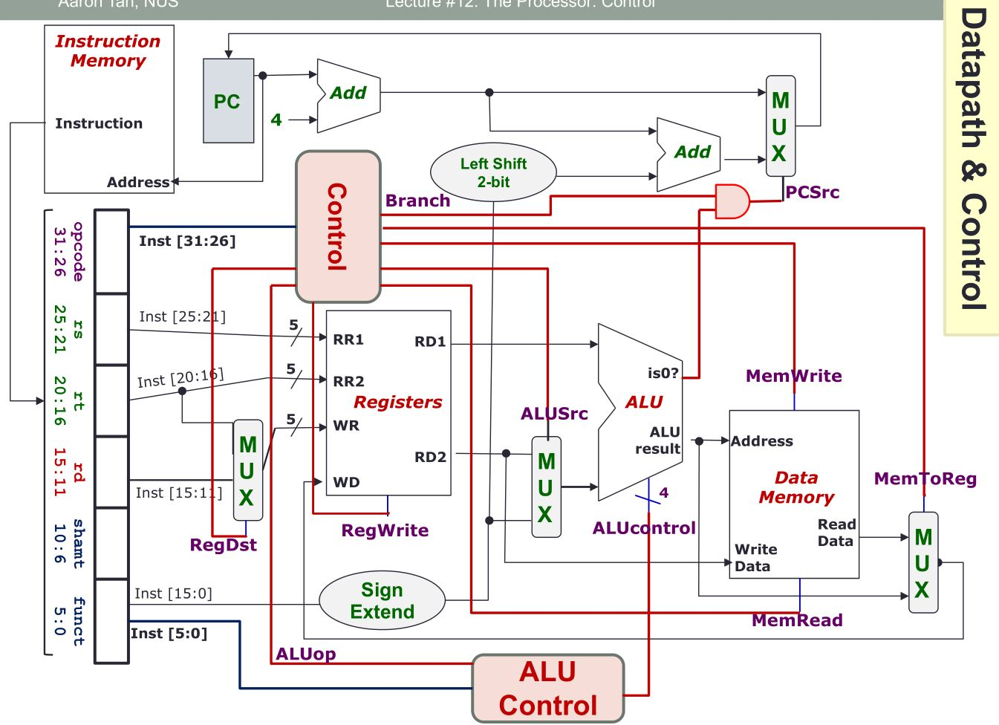

# CS2100 AY21/22 SEM1 notes

## Instruction set architecture, MIPS

**Memory means RAM, not disk. Instructions, i.e. call stack, heap, is on RAM**

- Computer can be broken down into: processor(performs computations), bus (links memory to processor), Memory(storage)
- Buses further divided into address(CPU -> Memory), data(memory -> CPU), Control(Control signals from CPU -> Storage)
  Out of syllabus: CPU instructions ~0.3ns, storage instructions ~80ns

### General purpose registers

- Fast memories, on **processors** (not RAM unlike cache etc.) -> e.g. rax, rbx etc.
- Usual processors 16-32 registers. Intel 4 registers. MIPS 32 registers ($0 ... $31).

**MIPS registers**

$1 is reserved for assembler

{" "}

<table>
  <tr>
    <th>Name</th>
    <th>Register</th>
    <th>usage</th>
    <th>Name</th>
    <th>Register</th>
    <th>usage</th>
  </tr>
  <tr>
    <td>$zero</td>
    <td>0</td>
    <td>Constant 0</td>
    <td>$t8-$t9</td>
    <td>24-25</td>
    <td>More temporaries</td>
  </tr>
  <tr>
    <td>$v0-$v1</td>
    <td>2-3</td>
    <td>Result values</td>
    <td>$gp</td>
    <td>28</td>
    <td>Global pointer</td>
  </tr>
  <tr>
    <td>$a0-$a3</td>
    <td>4-7</td>
    <td>Arguments</td>
    <td>$sp</td>
    <td>29</td>
    <td>Stack pointer</td>
  </tr>
  <tr>
    <td>$t0-$t7</td>
    <td>8-15</td>
    <td>Temporary values</td>
    <td>$fp</td>
    <td>30</td>
    <td>Frame pointer</td>
  </tr>
  <tr>
    <td>$s0-$s7</td>
    <td>16-23</td>
    <td>Program variables</td>
    <td>$ra</td>
    <td>31</td>
    <td>Return address</td>
  </tr>
</table>

### MIPS syntax

```
add $t0, $s1, $s2 # $t0 <- $s1 + $s2, adds s1 and s2, store result in t0
```

Come in the form of [operation] [result], [...params]
Compiler decides which variables mapped to which register (Variable mapping)

**Immediate** values -- numerical constants, i.e. a = a + 4 --> addi $s0, $s0, 4

- Immediate values from -2^15 to 2^15 - 1 (16 bit 2s complement)
- Assignment, f = g --> add $s0, $s1, $zero --> move $s0, $s1(**move is synctactic sugar**)

### Logical operations

**shift right and shift left does not work for -ve numbers!**

<table>
  <tr>
    <th>operation</th>
    <th>C</th>
    <th>MIPS</th>
  </tr>
  <tr>
    <td>shift left logical</td>
    <td>&#60;&#60;</td>
    <td>sll</td>
  </tr>
  <tr>
    <td>shift right logical</td>
    <td>&#62;&#62;</td>
    <td>srl</td>
  </tr>
  <tr>
    <td>bitwise and</td>
    <td>&#38;</td>
    <td>and, andi</td>
  </tr>
  <tr>
    <td>bitwise not</td>
    <td>~</td>
    <td>nor</td>
  </tr>
</table>

**nor is not opposite of xor -> returns 1 only if both are 0: 0 nor 0 = 1**

1. Shift left/right logical: sll $t0, %s0, 4 --> shift left 4 bits, useful for fast \*2
2. Bitwise AND: and $s0, $t0, $t1 --> good for bitmasking: parts where mask = 0 result is 0.
3. Bitwise NOR: returns 1 if both a and b are 0 --> good for inverting bits: nor $s0, $t0, $zero
4. Bitwise XOR: returns **1** only if both **different** 0

Loading large constants:

1. load upper immediate, lui $t0 0x4444 --> sets first 16 bits of t0 to 0x4444, last 16 bits to 0
2. OR immediate, ori $t0, $t0, 0x2222 --> sets lower 16 bits of t0 to 0x2222, first 16 bits padded with 0 so no change.

## Memory organisation

- word === unit of transfer between processor, memory. Usually 2^n bytes
- word alignment: words are aligned if address multiple of word i.e. 0x0, 0x4, 0x8 for word 4 bytes
- memory = 2^30 words

MOAR INSTRUCTIONS

1. Load word: lw \$t0, 4($s0) --> load word at memory address stored in $s0, + 4 bytes (i.e. bits $s0 + 4 to $s0 + 4 + word_size) into $t0
2. Store word: sw \$t0, 12($s0) --> store word from $t0 in address $s0 + 12
3. Load/Store byte: lb/sb, same as lw/sw, but read only 1 byte.
4. others: Half word, load/store halfword lh, sh; load word left, load word right ... lwl, lwr, swl, swr

## Decision making

- beq: Branch Equal to -- beq $s0, $s1, L1 --> goto branch L1 if s0 === s1
- bne: Branch Not Equal to
- j: Unconditional jump -- j L1 --> goto L1
- slt: Set Less Than -- slt $s0, $s1, $s2 --> set $s0 to 1 if s1 less than s2 else set to 0

## Instruction encoding

All instructions are 32 bits\* (MIPS32)
Signed values are 2's complement (invert + 1)
MIPS classifications

1. R-format: Register format -> op $r1, $r2, $r3 **Includes srl/sll**
2. I-format: Immediate format -> op $r1, $r2, Constant **Includes lw,sw**
3. J-format: Jump format -> j constant

### R-format

|opcode|rs|rt|rd|shamt|funct| > 32bits, |6|5|5|5|5|6|

- opcode: partially specifies instructions **R instructions opcode always 0**
- funct: combined with opcode to exactly specify instruction
- rs: Source register, first operand
- rt: Target register, second operand
- rd: Destination register, receiving register
- shamt: amount a shift instruction shifts. **0 in non-shift instructions**

<span style="background-color: #aa0000">NOTE</span> sll, rs is empty. source to shift
is placed in rt.

### I-format

**immediate constants are only 16 bits so need R-format with lui and ori for >16 bit numbers**
|opcode|rs|rt|immediate| > |6|5|5|16|
notice opcode, rs, rt same position
**rt taken as the destination now**
beq just put straight in, beq s1, s2, ... -> |beq|s1|s2|...|

<span style="background-color: #aa0000">NOTE</span> branch, first operand in rs second
operand rt

- opcode: uniquely defines register
- rs: source register
- rt: target register, **RECIEVES RESULT** unlike R-format's rt
- immediate: 16 bits **signed** integer (2's complement, invert + 1)
  load word lw, offset in immediate i.e. lw \$s1 12(\$s0) --> lw|\$s0|$s1|12
  branching also under I-format.

### J-format

Jumps to anywhere in memory
**direct addressing to memory location!**
|opcode|target addr| > |6|26|

- opcode is still kept to simplify processor design
- target addr: actual memory address (not PC relative)
  Since jump only to word aligned addresses, last 2 bits 00, can effectiely specify 28 bits
  MIPS chooses to take 4 MSB from PC+4 for remaining 4 bits

loop: addi $s1 0 // 0xF0A...A00
j loop // 0xF0...
some code // 0xF0...

addr = |~~0xF0~~|**0xA...A**|~~0x00~~| = _0xA...A_

- if PC+4 has very different 4 MSB from target addr, error can occur (jump too far).

**Max jump range 256mb**
example: [**1010**...][26 bits][00] -> 32 bits -> 1010(26 bits)00

<span style="background-color: #aa0000">NOTE</span> memory addresing always word
aligned, e.g. 128 bytes of memory only 7 bits rep. no need 128 * 4

<span style="background-color: #aa0000">NOTE</span> Instruction bytes always in multiples
of processor bits, e.g. 16 bit processor, instructions must be either 2 bytes or
4 bytes not 3. (round up)

_Examples_

> [R] add $s0, $s1, $s2 -> |0|\$s1|\$s2|\$s0|0|add_funct|
> [R] sll $8, $9, 4 -> |0|0|9|8|4|sll_funct|
> [I] addi $21, $22, -50 -> |addi|22|21|-50|
> [I] lw $9, 12($8) -> |lw|8|9|12|
> [I] beq $21, $22, Else -> |beq|21|22|1| assuming else is at PC + 8 (PC + 4 + 1 \* 4)
> [J] j addr -> |j|addr/4, truncated|

### Program counter

Special register keeping track of current instruction's address
**PC relative addressing**:
beq, bge (I-format) etc. 32bit address is bigger than 16 bits immediate
address parsed as (PC + 4) + (immediate _ 4) -> PC + 4 is the next instruction, immediate _ 4 since instructions all 4 byte
PC + 4 otherwise.
Therefore, immediate stores **number of instructions to jump** not bits

### Addressing modes

1. Register addressing: just specify the register e.g. add
2. Immediate addressing: constant in immediate e.g. addi
3. Base addressing: offset from address e.g. lw, sw
4. PC relative addressing: PC + **4** + immediate \* 4 e.g. beq, bne -> immediate is by **WORDS** not bytes! (beq \$0, \$1, 1 goes to PC + 8);
5. pseudo direct addressing: jump, 26 (+2) address + 4 bits MSB PC
   example:

```
32bit PC + 4: 0010.....
target address: 0010 100101010... 00
immediate = 100101010...
```

note: \$0($s1) works: assembler sees $0 as 0, no diff

## CISC vs RISC

CISC: Complex Instruction Set Computer (IA32/ x86)

- accepts complex instructions e.g. Fast Fourier Transform
- implemented as microcode to convert complex instructions into processor instructions
- Slower, each instruction might take > 1 clock cycle
  RISC (x64)
- Goal to make sure each instruction **executes in 1 clock cycle**
- Each instruction very simple

## Storage architecture

Stack: operands stored on top of stack **meaning data stored in stack, not call stack**
Accumulator: operant implicitly in special accumulator register
General Purpose Register Architecture:

- Register-memory(one operand in memory) Intel
- Register-register(load-store) MIPS, DEC Alpha
  Memory-memory: DEC VAX

## Endian-ness

0x FF EE DD AA
Big Endian: MSB in lowest addr
e.g. addr 0: FF, 1: EE ...
Little Endian: LSB in lowest addr
e.g. addr 0: AA, 1: DD ...

## Addressing modes

1. Register: $s1, $t2 etc.
2. Immediate: addi $t1, **69**
3. Displacement: lw \$t1, **20($t2)** -> note: 20 is equivalent to + 5 in MIPS32 **Displacement is in bytes**
   NON-MIPS:
   e.g. Register indirect: Add eax, [ebx] dereferencing
   ...

## Instruction formatting

2 kinds:

- variable length: instructions from 1 - 17 bytes, require multi step fetch/decode but CISC
- fixed length: 4 bytes long, RISC common; not many instructions available

## Fixed length encoding

Expanding encoding scheme: for operations with 1 less operand more bits availble, can specify more operations
e.g.
type A: |opcode (6 bits)|operand (8 bits)|operand (8 bits)|

vs

type B: |opcode (6 + 8 bits)| operand(8 bits)|

- type A ins: 1 to 2^6 - 1
- type B ins: 2^8 to 2^6 - 1 \* 2^8

## Datapath & control

- Datapath: Data processors, ALU/memory ops
- Control: sends instructions to datapath, memory, IO

### Instruction execution cycle



1. Fetch

- get instruction from memory, address in PC register
- Fetch instruction, PC += 4, output to next stage

2. Decode

- get instruction from fetch
- read opcode to get instruction type
- read data from necessary registers

```
1. Load rs into read register 1
2. Load rt into read register 2
3. depending on RegDest MUX: load rt or rd (part of immediate for I format) into write register
4. RegWrite indicates whether to write or not (to rd @ write data)
5. rs content output to read data 1
6. read register 2 content output to read data 2
7. depending on RegDest, load rt/rd into Write Register
8. depending on ALUSrc, take sign extended immeiate/Read data 2 as second output
```

3. operand fetch

- based on decode, get operands (R/I/J format)'s
- merged with decode in box diagram

4. Execute - runs the instruction: (1) ALU calculation stage (2) Memory access stage

```
ALU stage:
1. takes in 2 outputs from memory file output
2. set ALUcontrol to the correct opcode + funct
3. normal stuff: perfom operation e.g. add
4a. branch: immediate passed to adder circuits with PC,
4b. Mux determines PC + 4 or PC + 4 + immediate * 4 (sll 2) w/ control signal PCSrc
4c. output of MUX to PC
5. ALU output to memory stage

Memory stage, Data Memory block:
1. All other instructions remain idle
2. Loads Address from ALU
3. Loads data from Read Data 2
3. Control signal MemRead, MemWrite: only 1 0, do that. Both 0, do nothing. Both 1 undefined, should not happen.
4. Output to Read Data
5. ALU output w/ Memory stage Read Data MUX'd w/ control signal MemToReg
6. Output to register write
```

5. Result Write: store result of instruction

```
1. load Memory stage Mux into Write Data of register file
2. depending on RegWrite store Write Data in Write Register
```

### Elements

- Instruction memory: sequential circuit, has internal state to store info, clock signal assumed
- Clock signal: PC only copies in new value on rising edge of clock cycle, e.g. PC + 4: PC -> clock rise -> (PC + 4)
- Register file: collection of 32 registers, each 32bit wide, read at most 2 register/ write 1 register per instruction.
  - RegWrite control signal indicates: write (1)/ read (0)
  - rs -> read register 1, rt -> read register 2, rd -> write register
  - multiplexer MUX: I format, rt is "rd", MUX allows rt to go to write register.
  - Regdest = control signal, 0/1 determine where rt/rd goes
  - ALUSrc = control signal, determine if read from read data 2 or sign extended immediate value
- Multiplexer MUX: takes in RegDst to determine if rt should go to read register or write register
  - n inputs of same width (Sign extend if necessary)
  - m bits control input (where n = 2^m)
  - select ith input if control = i

### Control unit

Signals and effect (false 0 | true 1):

1. RegDst: WR = rt | WR = rd
2. RegWrite: Register not written | Register written
3. ALUSrc: Operand2 = RD2 | Operand 2 = sign extend immediate
4. MemRead: No memory read | Read memory from Address
5. MemWrite: No memory written | write RD2 to address
6. MemToReg: WD = Memory Read Data | ALU result
7. PCSrc: PC = PC + 4 | PC = sign ext... + PC + 4
8. ALUControl: ... below


**ALUControl signal**: controls ALU


<table>
  <tr>
    <th>Ainvert</th>
    <th>Binvert</th>
    <th>Operation</th>
    <th>Function</th>
  </tr>
  <tr>
    <td>0</td>
    <td>0</td>
    <td>00</td>
    <td>AND</td>
  </tr>
  <tr>
    <td>0</td>
    <td>0</td>
    <td>01</td>
    <td>OR</td>
  </tr>
  <tr>
    <td>0</td>
    <td>0</td>
    <td>10</td>
    <td>add</td>
  </tr>
  <tr>
    <td>0</td>
    <td>1</td>
    <td>10</td>
    <td>sub</td>
  </tr>
  <tr>
    <td>0</td>
    <td>1</td>
    <td>11</td>
    <td>slt*</td>
  </tr>
  <tr>
    <td>1</td>
    <td>1</td>
    <td>00</td>
    <td>NOR</td>
  </tr>
</table>

- Ainvert/Binvert: dictates whether input A/B should be inverted
- Operation: dictates which of the 3 results to choose (11 aka slt is special case)

### Creating ALUop signal

- 6 bit opcode sent to `Control`, produces 2 bit `ALUop`
  1. lw/sw: 00
  2. beq: 01
  3. R-type: 10
- `ALUop` combined with 6 bit `funct` in `ALU Control`
  1. AND: 0000
  2. OR: 0001
  3. add: 0010
  4. sub: 0110
  5. slt: 0111
  6. NOR: 1100

### Instruction Execution

Single cycle, In one clock cycle:

1. Read contents of memory/register
2. Perform computation
3. Write results to memory/register

Therefore, all instructions must take as much time as slowest instruction
i.e. load word

Workarounds:

1. Multicycle: Instructions broken up into diff stages, e.g. fetch, ALU, read register.
   each stage takes 1 clock cycle, clock frequency can be very high, but instructions take variable time to complete
2. Pipelining: Break instructions into execution steps per clock cycle, allow diff instructions to be in diff
   execution steps simultaneously
