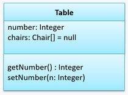
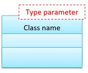
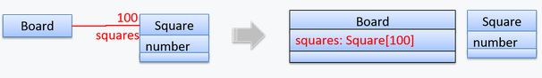
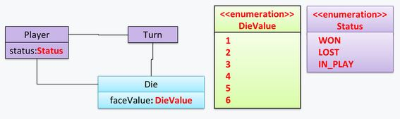
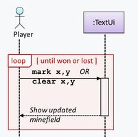

# CS2103T AY2122 SEM 1

General notes
Ctrl+Alt+L: Reformat code/style
Intellij not following code style: Ctrl+Alt+S: open code style, ensure project settings correct/same as default/ copy default to project

## Week 1

- OOP: programming paradigm, guides programmers to analyze/structure solutions
- OOP views world as network of interacting objects; Attempts to simulate the network
- Every object has an interface and an implementation.
- Objects interact by sending messages.
- Abstraction: OOP is abstraction -&gt; abstracts away lower details, e.g. method implementation/data formats
- Encapsulation: packaging -- groups data and behaviour in 1 unit; Information hiding: data/implementation hidden

## Week 2

- Software Dev Life Cycle (SDLC): requirements, analysis, design, implementation and testing.

### Project management

1. **sequential model**/waterfall model: software development as a linear process (req -&gt; design -&gt; implement -&gt; test -&gt; deploy)
    - each stage produces some artifacts usable in the next stage -&gt; requirements used in design, design used to implement etc.
    - useful when problem well understood
    - Problem: devs rarely understand the requirements of a project from the start.
2. **iterative models**: product goes through multiple versions
    - Each version improves upon old version from the feedback recieved. Product fully working at each iteration.
    - **Breadth-First**: Evolves all major components in parallel -&gt; add/enchance entire features
    - **Depth-First**: Focuses on fleshing out only some components -&gt; update one part e.g. backend to support future dev.

Revision Control:

- Manage multiple versions of the same software
- Uses Revision Control Software (RCS) aka Version Control Software (VCS)

Repositories:

- Database of history tracked by RCS, stores meta-data
- Can have multiple repos

Remote Repos:

- TLDR github/bitbucket
- Clone: copy repository onto local disk
- Upstream: Repository(s) your repo is derived from
- pull: recieve commits from another repo e.g. pull from upstream to sync
- push: write commits to another repo
- fork: create remote copy of remote repo
- Pull request(PR): request upstream to merge your commits

Quality Assurance(QA): Execute test cases, check output
Software Under Test(SUT)
Test case failure: mismatch between expected vs actual behaviour
Regression Testing: Modifications may result in unintended effects (Regression). Re testing every part of the SUT == regression test; usually automated.
Redirecting IO: java Program &lt; input.txt &gt; output.txt

## Week 3

RCS Branching: Evolving multiple versions of the software in parallel.
Merge Conflicts: trying to merge 2 branches that made diff changes to the same file

Packages: for organization. Requires package statement at top. Written as **All lowercase with dot as separator**

- Importing a package does not import sub packages
- import static -&gt; imports static members, can use without prefix, i.e. without packagename.STATIC_CONST
  
Coding standard: follow consistent style, aim to looks like code written by 1 person
Developer testing: done by devs themselves, usually durng development -&gt; Early stages easier to find bus, debug; less major reworks/ production delays
Unit Testing: testing individual units, i.e. classes, methods. Usually named ClassNameTest

- test case use camelCase + underscore i.e. addCommand_nullInput_fails()
Test driver: code that executes SUT for testing
Stubs: dummy classes to isolate SUT from dependencies. Implements same interface but much simpler/faked behaviour
- e.g. Foo takes in a Bar interface, create BarStub for testing rather than using actual BarConcrete

### UML

Models - abstractions, simple representation of an entity. Multiple may be needed to fully represent

- analyze entity
- communicate information to others
- blueprint for software creation

UML Diagrams

- Many different types, e.g. Object diagram, class diagram
- Diagrams can change over time
- But main rules, i.e. class structures, do not change

### Class diagrams [Box]

- describes structure (not behaviour) of OOP solution

- attributes/operations compartment may be ommited/ left blank
- **Visibility**:
  1. +: public
  2. -: private
  3. #: protected
  4. ~: package private
- Generic classes have generic in a box at the top left corner

- underline denotes static
- connections represent associations

**Arrows always point to parent/root/main**

1. Associations —/➜ (relationship, keeps reference) [solid line]
2. Association labels ▶: text with solid triangle, describe meanings e.g. tutor  mentors ▶ student
2. Roles: Indicate roles played e.g. *mentor* tutor --- student *mentee*
3. Multiplicity: number of objects that can be associated:
  e.g. 0..1, can have 0 or 1 other obj; 1, MUST have 1 other object; * is for any;
4. Navigability ➜: Unidirectional a refers to b but b no reference to a; Bidirectional opposite.
  Use ➜ arrow to denote
5. Shortening associations: instead of each attribute pointing to another box w/ association, you can put
  `name: type [multiplicity] = default`

  

2. Composition ◆— (whole-part) [Arrow, solid diamond head]

- Association but object is solely owned by the "parent/whole"
- When whole is destroyed all parts are destroyed
- **Cascading deletion != composition** -&gt; Even if whole destroyed all parts destroyed, may not be composition.
  Parts must be actually a part of the whole.

3. Aggregation ◇— (Container-contained) [Arrow, hollow diamond head]

- Composition but "parts" can exist without "whole"

4. Dependencies --➜ (relationship, temporary) [Arrow &lt; head, dashed line]

- For transient dependencies e.g. takes in dependency type as parameter
- **Only for non-obvious dep** Associations (store reference) is obvious

5. Inheritance —▷ (Is-a) [Arrow, hollow triangle head]

- point child --&gt; parent

6. Enums

7. Abstract Classes

- Denoted by italic *class name* or adding `{abstract}` in the UML header

8. Interfaces --▷ [Arrow, hollow triangle head, dashed line]

- Denoted by `&lt;&lt;interface&gt;&gt;` in the UML header, like enums
- Dashed line with hollow triangle head to implement

9. Notes --- [Note box shape, dashed line]

- Comments, can have dotted line to component note is referring to.

10. Association class

- Represents additional information about an association, e.g. `Transaction` between `Bank` and `Person`
- Dashed line from assoc class to solid line between 2 normal classes

### Object diagrams

- Maps each object instance and its relationship
- name syntax: Name:Class; unnamed = :Class

### Sequence diagrams

- Maps interactions between objects for a scenario e.g. function call
- Processes execute from top down
- **Entities**: actors e.g. user /components involved, usually at the top. component naming similar to obj diagram
- **Activation bar** [hollow box]: period where that component is in control/executing
  - arrow must point/originate from start/end *exactly*.
  - Calling other functions, original bar should not be broken.
- **Operation** [arrow, solid head]: function invocation, solid arrow from caller to instance activation bar.
Note: arrow represents function of dest: a -func->b, func is a method of b.
- return [arrow, solid head, dotted line]: dotted arrow back to caller w/ value
- **Lifeline**: dotted line below component, represents alive state

Notations:

1. Loops [loop]:

;

1. Object instantiation: arrow point out to new component, new component short activation bar (constructor), then return to creator.
Bar must start at top of entity.

NOTE
activation bars/return arrows can be omitted if they are not ambiguous/ lose relevant info (info about the task)

3. Object deletion[x]: arrow from lifeline of caller, lifeline of deleted object terminate with x at end of arrow
4. Self Invocation/ Invoke in activation bar:

Nest (stack) activation bars within each other: e.g. entity call its own method

5. Conditionals/ alt frames [alt]: Similar to loop frames, dotted line separate conditional branches
6. Optionals [opt]: like alt frames but with opt at top left w/ condition
7. Static access: like entity, but no name with &lt;&lt; class &gt;&gt; at the top
8. Reference/ Sequence diagram [ref/sd]: omit parts to draw in more detail, ref tag with sd name, sd frame w/ name drawn somewhere else
9. Parallel/multi threading [par]: par tag

## Static analysis

- Debug without running code
- finds unused variables, potential bugs, inefficient code
- e.g. linters

## Code reviews

- PR review: view on GH
- In pair programming: review on pair working on same code
- Formal inspection: Group of ppl systematically checking w/ diff roles
Code reviews can review coding standards, incomplete code, does not require test drivers, but is manual.

## Logging

- deliberate recording of information for reference.

## Use Cases

Sequence of actions + variants that system performs for a user action; **Interaction b/w system &amp; actors**

notes:

1. Use case should be only visible ones (no internal details where possible, e.e. saving)
2. Give intention, not action (clear input vs click button)
3. Loops can be detailed (steps x to y are repeated ...)
4. **Main Success Scenario**: most straightforward situation, no problems
5. **Extensions**: add-ons, exceptions/alternative flows to MSS usually numbered after the steps (exception from step 3 -&gt; 3a. exception: ...), or *a for alternative/exception in anywhere of MSS
6. Use case can _**include** other use case, in underline: Student **creates the survey(UC2)**
7. Preconditions: State system is expected to be in before use case
8. Guarantees: Specifies what use case guaranteed to do

Use Cases are not good for capturing requirements that do not involve user interaction.

## UML Use Case Diagram

- User roles shown as separate stick figures
- Use cases shown as ovals
- Extensions: dotted arrow pointing to MSS use case, with &lt;&lt; extend &gt;&gt; text
- Includes: dotted arrow with &lt;&lt; include &gt;&gt; text pointing to included Use Case

## Design approaches

- Top down: design high level components first, e.g. parser, UI etc. Good for large scale projects
- Bottom up: design low level components first, e.g. abstractCommand, UI components Good for reusing base foundations
- Mix: Top down first, then bottom up lower levels
- Agile Design: no fully defined models at start, only architecture, slowly evolves over time.

## Abstraction

- Data: hide low level data e.g. constants
- Control: hide implementation details, e.g. getVolume vs getArea*getHeight

## Coupling

Degree of dependency. High coupling, each component rely on many others.

- Harder to maintain due to ripple effect
- Harder to integrate since dependencies need to integrate
- Harder to test/reuse

`X` coupled to `Y` if change in `X` **might** need `Y` to change.
e.g. `X` calls `Y.f()`, then if `Y` renames f `X` needs to change.

others:

- Both depend on same global variable
- A calls B
- A recieves / returns B
- A inherits B

## Cohesion

High cohesion, related functionality together, unrelated kept separate

## Integration

1. Integrate once when all components finished (discouraged)
2. Integrate frequently, incrementally

## Project management

1. Milestones: indicates significant progress
2. Buffers: "breaks" in case of overruns
3. Issue tracker: track task assignment/progress
4. **Work Breakdown Stucture** (WBS): details tasks, details (sub tasks). Can also include estimated time req etc.
5. Gantt chart:
