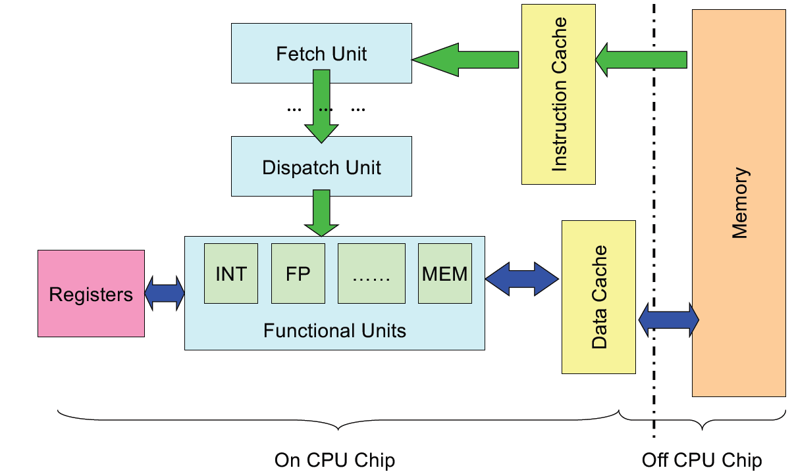
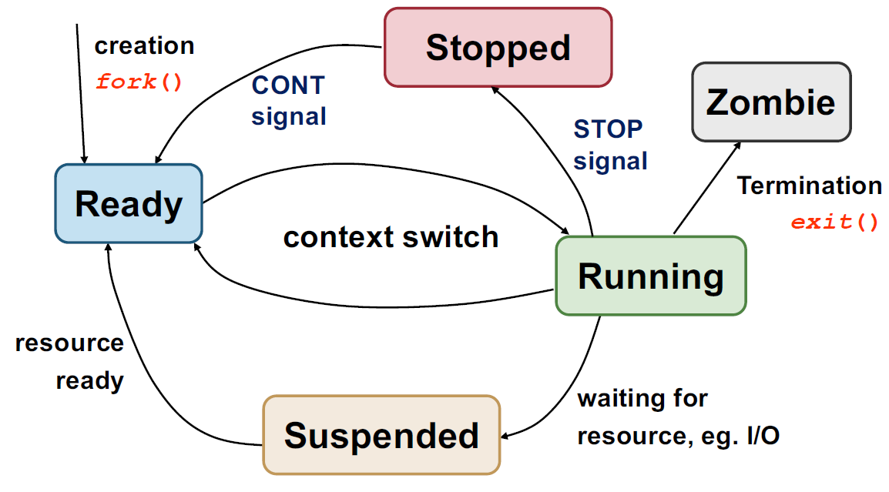

# CS2106 notes
## Memory structure
- hierachy: Registers -> CPU cache ->  DRAM -> Flash/PCM -> HDD
- Instruction execution:

## Stack
### Components
Higher addresses on top.

Text: stores instruction data

Data: Global variables, static variables

Heap: dynamically allocated memory, e.g. malloc/new

free space

stack: stack frames, local data

- stack frame: each function invocation data in 1 frame
- stack pointer: top of stack region(of all stack frames)

### Function processes
1. Caller push params to stack/register
2. Caller push return Program Counter to stack
3. Callee saves registers used by callee, e.g. FP/SP
4. Callee allocates space for its own local variables
5. Callee adjusts Stack Pointer
6. **Function retuned**: Callee restores saved registers
7. Caller continue execution (PC etc. restored)

## Processes

- Running -> suspend includes I/O, sleep etc.
- Process Control Block: |FP/SP/PC...|GPRs|Memory (Process' Stack)|PID|State|
- Process Table: stack of PCB's
- Context Switch: switch between executing processes, incl reload PCB
- Syscall: syscall number used as index, dispatcher gets handler, return once handler done.
- Exception: occurs @ machine level. Synchronous (happens at fixed position in execution), executes exception handler
- Interrupt: e.g. keyboard interrupt ctrl+c, asynchronous, interrupt handler called
- 