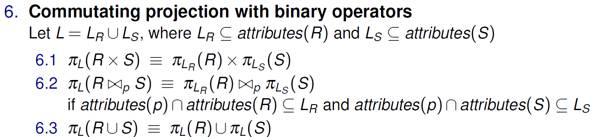

# CS3223

## Memory (Week 1)

### Memory hierachy (capacity, latency)

1. Registers (1KB, 0.3ns)
2. L1 cache (64KB, 1ns)
3. L2 cache (256KB, 3ns)
4. L3 cacge (2 - 4MB, 10ns)
5. dynamic RAM (4 - 64GB, 50 - 100 ns)
6. Disk (4 - 16 TB, 5 - 10 ms)

registers are 0.3ns, each level up x 3, memory 50 ns, disk 5 ms

### Access time
- command processing: parse SQL (considered negligible)
- seek time: move arms (perpendicular to disk) to correct track (5 - 6 ms)
- rotational delay: rotate track to correct block (average 1/2 rotion per access, depends on RPM)
- transfer time: move data to and from disk (move huge amounts of data = longer)
- **Disk access time** = seek + rotational + transfer
- **Disk access response time** = disk access time + queue delay

HDD avg sector transfer 100-200 microseconds, SSD 20-100 microseconds

### DBMS buffer pool

Buffer pool = cache of a DBMS, split into `frames` (block sized pages).
- client can request for a disk page to be fetched into pool or release a page from pool
- frames store s `pin count` and `dirty flag`. pin count == how many clients using, dirty == if it has been updated.
- frame can only be released in pin count is 0

Other than LRU, FIFO, MRU, Also have clock for page replacement policy. Basically a 1 chance round robin. 
circular array of frames, skip frame if pin count > 0, change referenced bit to false if pin 0 and bit is on, take page if pin 0 and bit off.
Turn reference bit on when pin count decrement to 0.

### File implementation
- Each record has an id called RID (page id + slot number). 1 page many slots.
- files organized as:
  1. Heap file, unordered. 
    1. page header store 2 linked lists of **pages**, 1 for free space, 1 for used.
    2. page directory has map to each data page.
  2. Sorted file, ordered by search key
  3. Hashed File, located in blocks by hash function

**Within a page**, fixed length records:
- packed: store records in contiguous slots, header stores number of records (slots).
- unpacked: use bit array to indicate if slot if full, can choose any slots.

Variable length records:

- offset of nth item stored at `H + n * L`, where `H` = Header size, `L` = size of pointer (offset + length)

## Indexing (Week 2)

- Indexes: data structures to speed up information retrieval
- Search key: sequence of 1 or more data attributes. Composite search key = at least 2 attributes. Unique index means search key is candidate key.
- Index stored as sorted index file. e.g. table `Weights(name, weight)`, index by weight `Index(weight, ptr_to_Weights_record)`. Can add more layers for efficiency

Tree based b+ tree indexing

- note that leaf nodes can store different formats:
    1. (weight, actual_record)
    2. (weight, record_id)
    3. (weight, record_id_array)
- Also has hashed based indexing, access by hash function.

### b+ tree operations

- non leaf nodes are not values: `[5]->[4][7]`, `5` __does not exist as a record__.
- order `x` b+ tree means nodes contain at least `x` nodes, at most `2x` nodes. (except root node, root at least 1 at most `2x`)
- usually cannot have duplicate keys (make composite key with unique attribute and range search instead)
- Insert:
    1. if page not full, insert.
    2. if page full, check right neighbor. if not full, redistribute. repeat for left if right full:
        1. take `2d` smallest records, store in page. rest in neighbor. update parent node.
        2. e.g. `[4]-->[1,3][4] + 2` &rarr; `[3] --> [1,2][3,4]`.
    3. split page:
        1. take `d` smallest records, store in page. `d+1` remaining records put in new leaf. add parent index as smallest of `d+1` leaf node
        2. if index node needs to split, `d` smallest indexes in 1 node, `d + 1` largest indexes in 1 node. remaining 1 extra promote to higher depth.
        3. e.g. order 1: `[4,8]-->[1,2][4,5][8,9] + 10` &rarr; `[4,8,9]-->[1,2][4,5][8][9,10]` &rarr; `[8] --> ([4] --> [1,2][4,5]) ([9]-->[8][9,10])`.
- Deletion, underflow (node empty/ too little entries):
    1. page not underflow, ok.
    2. page underflow, check right neighbor size > `d`, redistribute 1 record (see insert). else repeat for left.
    3. merge nodes:
        1. if neighbour size `d`, merge for `2d - 1` size. remove index in between.
        2. if index node underflow, merge. pull parent index key down
        3. e.g. order 2: 
            `[10] --> (other) ([20, 30] --> [10, 11][20, 21][30, 31]) delete 11` &rarr; 
            `[10] --> (other) ([30] --> [10, 20, 21][30, 31])` &rarr;
            `[other, 10, 30] --> [...other child][10, 20, 21][30, 31])` done.

    

---

- clustered index: order (i.e. sort order, not b tree order) of index is same or "similar" to actual order of records (in data storage). 
  Can only have 1 clustered index for each relation. e.g.: actual records sorted by id, clustered index = index on id
    - any index using format 1 (index, actual_record), is definitely clustered (since it stores the actual records)
- dense index: **index record** for every search key value exists. sparse index otherwise.
    - e.g. actual data `[1,2,3,4]` (in dlinked list), sparse index `[3] -> [1][3]`. To find 2 go to 1 and iterate `1 --> 2`. dense index `[3] -> [1,2][3,4]`.
    - sparse index relies on fact that data is sorted, so to find 2 you can iterate from 1 on the disk page.
    - unclustered index definitely dense, since data is not sorted in terms of search key, have to keep each search key as index record

### Hashed based indexing

access cost 1 w/o overflow page (+1 RID lookup if necessary)

#### Static hashing
- N buckets, store item with hash h in bucket `h % N`.
- if primary data page full, make linked list of pages (`overflow data page`)

#### Linear hashing

1. Check if bucket `j` to insert to is full. Insert if not.
2. If `next` is not `j`, split bucket `next`. next++. insert page into overflow page.
3. If `next` is `j`, split bucket. next++. If bucket to insert into is still full, insert into overflow page.
4. if `next` is `Nlevel` during split, set `next` to 0, level++. `Nlevel` = `2^level - 1`

**NOTE**: If overflow page is not full, do not split. i.e. only split when a new overflow page is added.
**NOTE**: To make maximum number of splits, example: bucket size 2, insert(10000, 100000, 10, 100, 1000) -> 10 cause split, never create overflow. 100 cause split, create overflow. etc.
- deleting:
    1. if next > 0 and last bucket empty (e.g. size 6, next = 2 so last bucket 5 empty), decrement next by 1, delete last bucket
    2. if next = 0 and last bucket empty (size 4, next 0, bucket 3 empty), decrement level, set `next` to last bucket of previous level (size 3 level 0 next 1)

#### Extendible hashing

- like linear hashing, except:
- keep directory of pointers to buckets
    1. say size 4, bucket 1 (01b) overflows. double directory pointers (unless bucket 3 also points to bucket 1, see below). 
    2. bucket 1 (001b) and bucket 5 (101b) each have their own pointer.
    3. other buckets stay: bucket 0 (000b) and bucket 4 (100b) both point to same original bucket 0
    4. check if can merge on delete

**NOTE**: to check last bracket that had been split, total number of entries of (bucket + split image) must be at least (bucket_size + 1).

Could have been a bucket with 4 pointers split into 2 pointers each, need not be only buckets with 1 pointer

## Sorting and selection

### External sorting

- External sorting with x data pages using `m` buffer/memory pages (x >> `m`):
    1. use all `m` memory pages at a time, sort m pages from data records, write to disk as block `M1`.
    2. merge `M*` pages: let `m - 1` memory pages be input pages, take first page of `m - 1` `M*` pages.
    3. write smallest records into 1 memory page, when memory page full write to disk.
    4. if 1 input page used completely, take next page from the same `M*` page.
- optimization, blocked I/O
    - system sometimes allow reading of `b` contiguous pages in 1 i/o operation
    - make 1 block (of `b` pages) for output
    - floor divide number of remaining pages `k = (m - b)//b`, `k` input blocks.

### B+ tree sort select

Sorting with B+ tree, B+ tree already there:

- clustered index just scan (records alr there)
- unclustered index for each RID retrieve record.

Select:

- selectivity of access path = no. of index/data pages that need to be accessed to get data records
    - usually most selective access path = traverse down smallest value, iterate right 
- covering index for query `Q`: index contains all info required for query (no need fetch with RID etc.)
- for `where ... and`: either look up RID and filter, or if b+ tree index for `and` also exist, find intersection of both trees.

### Conjuncts

- Conjunctive Normal Form: express in ands (each AVB is a conjunct): `(A V B) ^ (B V C)` etc.
- index I on attribs (`K1, ... Kn`) matches predicate `p` if 
    1. b+ tree: `p` is of the form `(K1 = c1) && ...(Ki = ci) && (Kj op cj)` &rarr; at most 1 non `==` op, non `==` must be last attrib. does not have to be all of index.
    2. hash index: `p` is of the form `(K1 = c1) && ... (Kn = cn)` for some `c*`. (All attrib used, `=` not `>` etc.)
- `primary conjuncts`: subset of conjuncts in predicate `p` that index **matches**: index on weight, predicate (weight = ..., name = ...), primary conjunct weight.
- `non primary conjuncts`: conjuncts in p that are non primary
- `covered conjuncts`: conjuncts in p that index I covers, e.g. index weight + height, predicate weight + name, covered = weight. (weight not primary)

### Calculating cost

- calculate number of pages accessed B+
    1. cost to navigate internal nodes = depth = `log(num_leaf_nodes, branch factor)`.
    2. scan leaf pages: `num_leaf_to_select / num_entries_each_leaf`.
    3. retrieve data records: 0 if format 1(alr got),  `numRecordsSelected` otherwise. (can optimize by sort: max = `min(numTotalPages, numSelectedRecords)`, min `numRecordsSelected / recordsPerPage` )
- calculate number of pages accessed hash
    1. cost to get leaf pages: `numLeafToSelect / numRecordsPerPage`.
    2. cost to retrieve data: 0 if format 1, same as B+ otherwise.

{/* TODO: add tutorial notes */}

## projection

- picks out a subset of columns, then removes duplicates from results, return.
- if project with asterisk, no deduplication.
- if index already exists on search key containing all wanted attributes, can just index scan.

### Sort based approach

process:

1. Extract columns matching attributes `a`
2. sort all columns, then remove duplicates

cost:
- read all pages of original table `R` (num of pages)
- write to intermediate table `T` (num of pages R projected columns non dedupe)
  - can optimize, write as initial sort runs, -1 merge depth next step
- sort records: `2 * T * m`, `m` = number of passes (log initial sorted runs base merge factor + 1), `2x` for rw
- scan and dedupe: `T` (0 if dedupe during merge)
- no write cost since return after dedupe.

### Hash based approach

process:

1. [partition] setup 1 input buffer, rest output buffers. read 1 page per time, for each tuple remove unwanted attributes then apply hash function
2. [partition] when output buffer full write to disk. (group output by output buffers, no tuple exist in 2 groups)
3. [dedupe] setup 1 input buffer, rest use as in memory hash table. read partition output 1 page per time, for each tuple insert into hash table if not yet inside.
4. [dedupe] if hash table is too big in step 3, recursively apply hash based partitioning to overflowed partition.

cost:
- hash based is effective if bucket size is large relative to size of table. (`Bucket size <= sqrt(T)`)
- read all pages original table `R`
- write all partitioned buckets `T`
- deduplicate, rw all paritioned buckets `T` 

## Joins

`Outer join Inner/R join S` (inner always rhs)

### Iteration

**NOTE**: output write cost ignored (return result).

**Loop Join**:

- For each record in Outer, check if matches record in inner. if match, output. 
- optimization, **page based loop join**: for each record in outer page check each record in inner page.
- cost: scan R = `numPagesOuter` + for each scan S = `numRecordsOuter * numPagesInner` (or `numPagesOuter * numPagesInner` for page based)

Block nested loop join
- use 1 buffer page for output, 1 page for outer input, `B - 2` pages for inner input. for each `B-2` pages do block based join.
- cost = `numPagesOuter` + `numPagesOuter/(B - 2) * numPagesInner`.

Index Nested Loop join
- if join on attribute A and index on Inner.A exists (all attribs of join), then for each record in Outer search index for corresponding A and join.
- cost = `numPagesOuter` + `numRecordsOuter * (numInnerInternalDepth + avgLeafNodesPerKey)`

### Sort merge join

- Sort inner and outer, merge. 
- if need to cross on both sides need rewind: inner = `10 10 20 21`, outer = `10 10 11 12`, after `inner1,outer1; inner1,outer2`, `inner2 == inner1` so rewind to `outer1`.
- cost: external sort cost + `numPagesInner` + `numPagesOuter` (assuming no cross like above, else `numRecordsInner * numpagesOuter` cross pdt)
- optimization: if number of buffer pages > `sqrt(2 * numPagesInner)`, assuming inner >= outer pages, no need to continue merge in initial sort, can join already (take smallest page of each sorted run)

### Hash join

- hash inner, outer into `k` partitions each
- say inner.A = 1 in partition 1 and outer.A = 1 in partition 3, join partition 1 + 3.
- partition x of inner used to populate hash table. read each page of partition x outer, for each record probe hash table, write to output.
- when output buffer full write to disk (if output buffer not full do not write to disk even after partition pair joined)
- if hash table does not fit in memory recursively partiton overflowed partitions
- cost: `3 * (numPagesInner + numPagesOuter)` (assuming no overflow partition)
- number of partitions `k = B - 1`, `B approx == sqrt(f * numPagesInner)` where `f` is fudge factor

## Aggregation

- simple aggregation: `select count(*) from T`, maintain counter table scan.
- group by aggregation: `select year, count(*) from M group by year`.
    1. sort by group attibute and scan (make use of covering indexes, index scan if exists)
    2. build hash table with group attribute key, for each group aggregate

## Query evaluation

- Materialized evaluation: evaluate an operator (e.g. JOIN etc.) only when all operands have been fully evaluated. intermediate results materialized on disk (temp table).
- Pipelined evaluation: pass intermediate result directly to parent (streaming, pass even when not finished yet). operator execution interleaved.
- blocking operator: operator needs all inputs from child operators to produce output (external sort pass 0 needs all, grace hash join)
- each operator 3 methods: `open` (init), `getNext` (record to be streamed), `close` (deallocate memory etc.)

### Query plan tree types

- linear: at least 1 operand of every join is base relation (not result of another join)
- left-deep: every join operation, right operand is base. vice versa right deep.
- bushy: not linear.

{/* TODO: continue lect 6 */}

