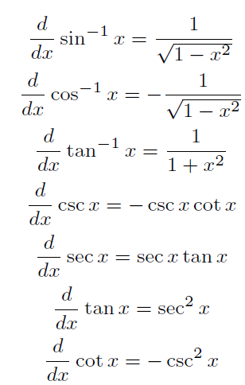
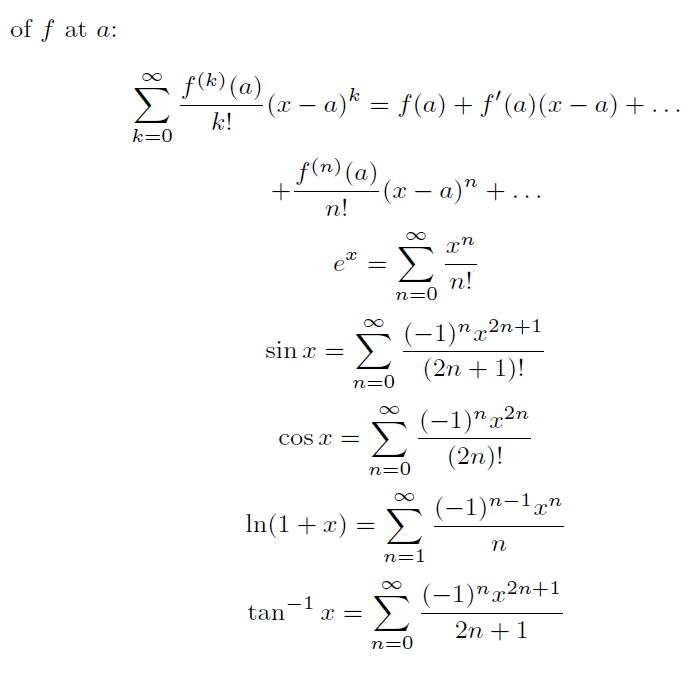
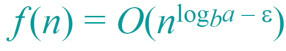
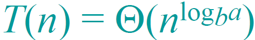
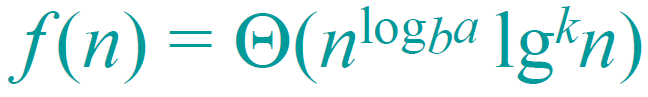
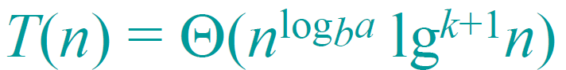
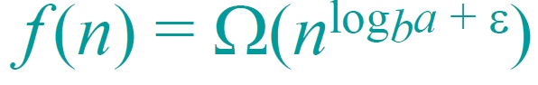

## stable matching

- input: given 2 distinct groups of people each with their own rankings of people from the opposite group
- output: stable matching of people: there does not exist 2 pairs (x1, y1), (x2, y2) such that x1 likes y2 more than y1 and y2 likes x1 more than x2
Gale-shapley algorithm:

```py
while # exists free man, m, that has not proposed to every woman:
  w = # first woman on m's list not he has not proposed to yet
  if w.status = free:
    engage(w, m)
  else if # w prefer m over current partner m_old:
    engage(w, m)
    free(m_old)
  else:
    continue # w rejects m
```

- men optimal: gale shapely always returns arrangement where men get their best possible stable matching → reason because men always propose from highest down, if highest is stable already will not change
- women pessimality: gale shapely always returns worst stable matching for women

## Asymptotic analysis

- **Word ram model**: RAM = array of words; runtime counts instructions (e.g. mul = 1), ignore compiler optimizations/ OS multithreading etc.
- Notations: for function `f(n)` w/ asymptotic `(n^2)`
  - Big O: `O(n^2)` → `0 <= f(n) <= c*(n^2)` for some constant `c` and where `n > k`, for some constant `k`.
  - Big Omega: `Ω(n^2)` → `0 <= c*(n^2) <= f(n)` for some constant `c` and where `n > k`, for some constant `k`.
  - Big Theta: `Θ(n^2)` → `0 <= a*(n^2) <= f(n) <= b*(n^2)` for some constant `a`, `b`and where `n > k`, for some constant `k`.
  - small o `o(n^2)`, omega `ω(n^2)`: like big notation, but **not equal** → `o(n^2)`, `f(n) < c*(n^2)` for all values `c`, when `n > k` for some constant `k`
- Limit method: as n → infinity, `f(n)/g(n)` → `x`
  - `x == 0`: `f(n) = o(g(n))`, since `f(n)/g(n) = 0`, `f(n)/g(n) < k`, `f(n) < k*g(n)`.
  - `x < infinity`: `f(n) = O(g(n))`.
  - `x < infinity, x > 0`: `f(n) = Θ(g(n))`.
  - `x > 0`: `f(n) = Ω(g(n))`.
  - `x == infinity`: `f(n) = ω(g(n))`.

### Asymptotic useful shit

- **Stirling approximation**: `log(n!) = Θ(nlogn)`; also, `log(a) * log(b) = log(ab)`.
- `e^x` >= `1 + x`
- `k^n` > `n^a`, for any `k` > 1, and `a`.
- `lg^2(n) == (lgn)^2 != lglgn`, `lg(ab) == lga + lgb`, `lg(a^n) == nlga`, `logb(a) == 1/loga(b)`, `a^logb(c) == c^logb(a)`.
- 1 + 1/2 + 1/3 + ... 1/n = `ln(n) + O(1)` (Harmonic), 1 + 2 + ... n = `n(n + 1)/2` (AP), 1 + x + x^2 + ... x^n = `(x^(n + 1) - 1)/(x - 1)` (GP).
- L'hopitals: lim x → infinity, `f(x)/g(x) == f'(x)/g'(x)`, e.g. (`logn/n == 1/n/1`)
 

## Correctness

Using a loop invariant (e.g. `array [1 .. j] sorted after j iterations`)

1. initialization: show loop invariant true before iteration
2. mantenance: show if invariant true before iteration, remain true after 1 iteration
3. termination: when algo terminates, can be used as property to show correctness (e.g. `array [1..n-1] is sorted and no element gt [n] exists`, imply whole array sorted)

### solving recurrence

1. Recursion tree: draw whole recursion tree, e.g. merge sort; lgn levels each level n ops, total nlgn
2. master method: `T(n) = aT(n/b) + f(n)` where `a` >= 1, `b` > 1, `f` asymptotic positive. compare `f(n)` w/ `n^(log(a)baseb)`.
   1. `f(n) = O(n^(log a base b - k))` for some constant `k > 0`: `T(n) = Θ(n ^ (log a base b))`, fn grows polynomially slower than n ^ log a base b (by n ^ k factor)
     
   2. `f(n) = Θ(n^(log a base b) * lg ^ k(n))`, `k >= 0`, (e.g. k = 2 → (lgn)^2), then `T(n) = Θ(n ^ (log a base b) * lg ^ (k + 1)(n))`, both grow at similar rates
     
   3. `f(n) = Ω(n^(log a base b + k))`, `k > 0`, `T(n) = Θ(f(n))`, `f(n)` grows faster by `n ^ k`, **satisfies regularity condition** `af(n/b) <= cf(n)` for some c
     
3. substitution method:
   1. guess a time complexity, e.g. `T(n) = n^2`, so T(n) <= cn^2 for some c
   2. substitute recurring `T`'s with eqn: `T(n) = T(n/2)` → `T(n) = c(n^2)/4`.
   3. show result is less than guess: `c(n^2)/4 <= cn^2`.

## Randomized algorithms

- Basis works on E(X) = sum(All possible cases * probability of each case)
- Ex: quicksort, let Ai be a permutation where the ith largest element is the first index (i.e. picked as pivot). E(X) = sum(Expected Ai runtime) / n
- Randomized algorithms usually are simple, can approximate good solutions much faster than deterministic
- Bernoulli trial: success probability, p, failure 1 - p. # of bernoulli trials before first success, expected = 1 / p.

## Hashing

- `U`: universe, all possible values to be hashed, `M`: the size of array to be mapped to, `N`: number of stored items
- Randomization: randomize the hash function used, so we do not keep colliding on specific indexes
- Universal hashing: suppose randomized hash function, set of all hash functions = `H`. Universal hashing → `|h(x) == h(y)|/|H| <= 1/M`: for all `x`, `y` where `x != y`, number of hash functions `h` that collide / number of hash functions total <= `1/M`.
- pairwise independent: Pr(h(x) = a, h(y) = b) = 1/M^2, for all x, y, h.
- For any universal set of hash functions mapping U → M, for any N elements the expected number of collisions < N/M
- For any universal set of hash functions,if M >= N, expected cost for N insertion/deletion/queries = O(N) → for each in N expected cost O(N/M) = O(1) each
- Perfect hashing: expected worst case constant time, if `M=N^2`, expected num collisions < 1. (**Theorem: there exists hash function U → M where |M| = N^2 with no collisions**)
  - 2 level scheme: each index is another hash map. at each index choose second level hash function with no collisions (`M=N^2`)
  - if H is universal, Expected size of all secondary arrays in 2 level scheme < 2n

### Amortized analysis

- `O(n)` = worst case of a single operation; Amortized worst case = average each case in worst case running all k operations.
- **NOT the same as average case analysis**.
- Aggregate method
  - sum worst possible k operations, divide by k. (if many diff operations pick worst possible permuation of operations)
  - tedious, provide upper bound on true cost. cannot provide amortized cost of each operation, only of whole set of operations
- Accounting/ Bankers method
  - Assign common, low cost ops a higher cost, which pays off higher cost, less common operations e.g. increase `INSERT` cost by 1 so `DELETE ALL` cost can be 0
  - Actual cost must be <= amortized cost
  - show bank never decreases below 0
- Potential method
  - define potential function ϕ(i) wuch that ϕ(i) >= 0 for all i,  ϕ(i) = potential at the end of ith operation. Try to select ϕ such that costly operation, `∆ϕ` is negative, negates actual expensive cost. (find decreasing qty during operation)
  - Amortized cost of ith operation = `actual_cost(i) +  ϕ(i) -  ϕ(i - 1)`.(potential difference, `∆ϕ(i)` = `ϕ(i) -  ϕ(i - 1)`)
  - Amortized cost n operations = actual cost n ops + `ϕ(n) - ϕ(0)`.
  - To show actual cos n ops = `O(f(n) + ϕ(0))`, just show amortized `O(f(n))`.
  - e.g. binary addition, expensive operation, flip k bits to 0, longest suffix of 1's decrease. `ϕ(i) = 1 + length longest suffix`.
  - draw table, columns `actual cost`, `∆ϕ`, `amortized cost`. each row = 1 case, e.g. expensive case + normal case. show amortized cost still same, total cost = n * amortized cost.

### Longest Common Subsequence

- definition: subsequence = sequence of chars in A, can skip chars e.g. ACE = subsequence of ABCDE
- if LCS last character at A[n], B[m], then LCS(n,m) = LCS(n-1,m-1) + A[n]
- DP solution: make mxn array of 0. if ai = bj, then T[i,j] = T[i-1, j-1] + 1, else T[i,j] = max(T[i, j-1], T[i-1, j])

### Knapsack/ coin change

- for each item, either take or do not take: recursive `return max(func(weights[1:n-1], free - weights[n]), func(weights[1:n-1], free))`.
- maximize value, `v`.
- DP: `A[i, weight]` = max value given weight. `for i, j: A[i, j] = max(A[i, j - weight[i]] + value[i], A[i-1,j], A[i,j-1])`.

### DP requirements

- express problem recursively (optimal substructure: optimal solution involves optimal for smaller problems)
- show small/polynomial number of subproblems
- show overlapping subproblems

### Greedy algorithms

- recast problem so only 1 subproblem to be solved at each step. beats divide n conquer, DP. e.g. sorting, take the smallest item each time
- **Show greedy**: greedy property: optimal solution to original problem uses greedy choice, e.g. selection sort
- Minimum Spanning Tree: Prim's algorithm → optimal substructure, given MST T, remove 1 edge, both subtrees are MST. Least weight edge between 2 sets of subtrees must be in MST.

```js
# For each vertex not connected yet, sort by the minimum weight edge connecting it to alr connected vertices
prio_queue = vertices
prio_queue = vertices.map(x => Vertex(x, INFINITY))
decrease_weight(prio_queue[0], 0)
while prio_queue.length > 0:
  minimum = prio_queue.heappop()
  for neighbour in minimum.adjacent():
    if neighbour in prio_queue && weight(minimum, neighbour) < neighbour.min_weight:
      decrease_weight(neighbour, weight(minimum, neighbour))
      edge[neighbour] = minimum
```

- Time complexity:V *`heappop` + E* `decrease_weight`.
  - array(`heappop`: O(V), `decrease_weight`: O(1), total: O(V^2))
  - binary heap: array(`heappop`: O(lgV), `decrease_weight`: O(lgV), total: O(ElgV))
  - fib heap: array(`heappop`: O(lgV) amortized, `decrease_weight`: O(1) amortized, total: O(E + VlgV))

### Network flows/ incremental algorithm

- Digraph (V,E), each edge (u,v) has capacity c(u,v), want to maximize flow f(u,v). flow conservation, input into vertex = output from vertex
- Ford Fulkerson algorithm O(V * E^2)
  1. Find a path from s to t (t = only incoming, goal node) (withour going through 0 capacity edges)
  2. max capacity = highest capacity (bottleneck) of path. residual capacity of each edge = original capacity - max capacity of path
  3. decrement (u,v) by max cap, increment (v,u) by max cap
  4. stop when no more path to t
- maximal flow =  (informally) sum of all incoming edges to s in residual graph; or form flow graph (sum of all residual capacity outgoing from S)
- minimal cuts: S = {nodes reachable from S in residual graph}, T = {nodes reachable from t in residual}
  - For each edge (u,v) w/ u in S v in T, `flow(u,v) == capacity(u,v)`; (v,u), `flow(v,u) == 0`.
  - represent the bottleneck, maximal flow.
  - Given any cut w/ 2 sets A, B: sum of capacities from A → B >= capacities S → T

### Linear programming

- Goal: **maximize** equation (must be maximize)
- Format: 1. objective: maximise (x + 2y) 2. variables: x, y >= 0 3. constraints: x <= 10, -y <= 15 etc.
  - can use summation eqn: sum(i member E) xi <= 1
- subject to many contraints (each linear eqn a1\*x1 + a2\*x2 ... **<=** bi), must be <=
- graph of parameters e.g. xi, form a graph, based on constraints, optimal point must be in contained area.
- Compute in polynomial n,m time, e.g. max flow polynomial |V|,|E|.
- Simplex algorithm for linear programming: each solution must be a intersection/vertex (x <= 20 intersect y <= 10). efficient in practice, exponential worst case theoretical (exponential vertices)

```py
start = feasible_vertexes()[0]
for neighbour in start.neighbour_vertexes:
  if calculate_obj(neighbour) > calculate_obj(start):
    start = neighbour
    restart()
return start
```

### Reductions

- `A reduces to B`: Problem A w/ instance 𝛼, convert 𝛼 to instance 𝛽 from problem B, solve problem 𝛽, then use solution to find solution to 𝛼
  - **Prove can reduce**: A has solution iff B has solution (A is a YES instance iff B is a YES instance)
- `A has p(n) reduction to B`: A <=p B 𝛼 to instance 𝛽 takes p(n), solve 𝛽, convert back to 𝛼 in p(n) time. (n == no. of bits)
  - for p(n) reduction if T(n) solution to 𝛽, runtime = O(T(p(n)) + O(p(n))): 𝛼 to 𝛽 at most p(n) elements output, so solution takes T(p(n))
- pseudo polynomial algorithms: poly time in numeric value of input (or length of input), exponential in length of input representation (no. of bits required to represent the entire input) → input 123 O(1), in binary form is O(logM)
  - e.g.: selection sort list on n integers: input representation length x = 32n (4 bytes int), runtime O(n^2), O(x^2) [constants removed]
  - e.g.: naive isPrime: check if integer n is prime. numeric representation time = O(n) [ignore mod cost], input representation length x = logn, input rep time = O(2^x), non poly. pseudo poly time.
  - e.g.: Knapsack DP, O(NW), N = no elem, W = max weight. W length x = logW. total time O(N*2^x)
  - note: suppose input = array size N, each integer size logk. encoding length L = Nlogk. if algo = O(Nk) == O(c ^ logk *N) == O(c ^ L/N* N), pseudo poly.

### Intractability

- decision problem = given input a, output T/F. Optimization problem = e.g. MST
- decision problem reduces to optimization. If cannot solve decision in poly, cannot solve optimization in poly.
- decision reduction to decision: 𝛼 = T iff 𝛽 = T; 𝛼 to 𝛽 transformation takes poly(𝛼) time

### P vs NP

- P: solvable in poly time
  - P subset NP: if problem can be solved in P, then verifier can just be the algorithm, certificate = input
- NP (Non deterministic Polynomial): problems that poly time reduces to 3SAT (e.g. vertex cover, independent set, set cover)
  - NP proof: there exists a poly time verification algorithm: check if certificate (derived in poly time from output) + instance is legit.
  - certificate can be full solution: "Check if TSP possible" → output boolean possible/not, certificate can be TSP cycle.
  - even if problem is boolean (e.g. check if subset exists), certificate can be the subset.
- co - NP: poly time verifiable certificates (counter examples) of NO instances exist
- NP-complete: problems computationally equivalent to 3SAT. NP-hard + in NP
  - Proof: X is in NP, and 3SAT/any NP-complete reduces to X in poly time
- NP-hard: any problem B in NP can reduce to A, then A == NP hard. hardest problems in NP
- P = NP, NP problems can be solved in poly time. P != NP, no poly algo exists for NP-complete

- Problems:
  - SAT (NP-Complete): boolean satisfiability, check if exists a assignment of T/F to  variables s.t. boolean statement = True
- NP-hards:
  1. 3SAT (NP-Complete): each clause (CNF (x V y V z) ^ (a V b V c))) has exactly 3 literals, reduces to a lot of problems
  2. Independent set (NP-Complete): find subset at least size k where no vertices adjacent
  3. Vertex cover (NP-Complete): find minimal set of vertices such that each edge at least 1 vertex picked
  4. Partition (NP-Complete): given array of numbers partition numbers such that difference in total sums is minimized. (cannot greedy: try 16 14 13 13 12 10)
  5. Set cover (NP-Complete): Given collection of subsets of S, find at most k subsets that when union give back S
  6. INT program (NP-Complete): given constraints {a\*x1 + ... f\*x5 <= b1, g\*x2 + ... k\*x69 <= b2, ...} check if x1 ... can be assigned values {0,1} (0 or 1) s.t. all constraints satisfied
  7. (Directed) Hamilton cycle (NP-Complete): check if there is a cycle that visits every vertex exactly once
  8. Subset sum (NP-Complete): determine if there is a subset that sums up to t.
  9. Knapsack (NP-Complete, pseudo poly NW): given an array of items with weight w and value v, find max value that can fit into bag of capacity C.

### approximation

- Approximation ratio: Approx solution C / Actual solution C* (minimization problem. Flipped for maximizing)
- Approx vertex cover: pick an edge add both vertices, remove all adjacent edges. repeat until no more edges. Approx ratio <= 2
- Approx set cover: each iteration, greedy pick set with most elements not picked yet. Approx ratio O(logn)
  - Proof: suppose at step i, k elements remain. Assume optimal pick m sets. then there must be a set of <= m sets that cover k. therefore there must be a set with at least k/m elements.
- Approx 3SAT: assign T/F randomly C* / C <= 8/7 (C == expected no. of clauses satisfied) → each clause `a V b V c`, only 1/8 chance never satisfy anything
- Approx Knapsack: (has pseudo poly time w/ DP O(nW), n = no items W = max weight or O(n^2\*max(v)))
  - scale each v to `math.ceil(v / k)`, `k` = eV/n → runtime from n^2V to n^2V/k == n^3/e
  - Approx ration C*/ C <= 1/ (1 - e)
  - set e to whatever, smaller e more accurate.
