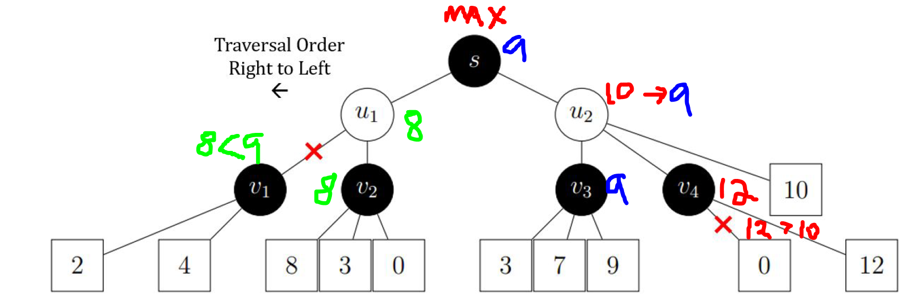
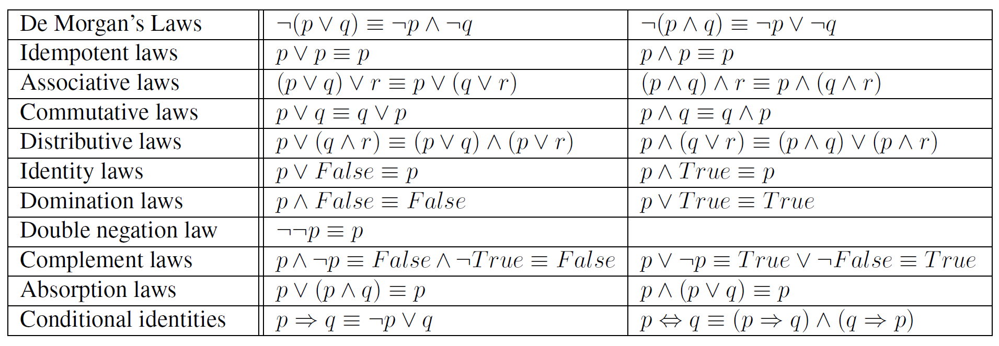
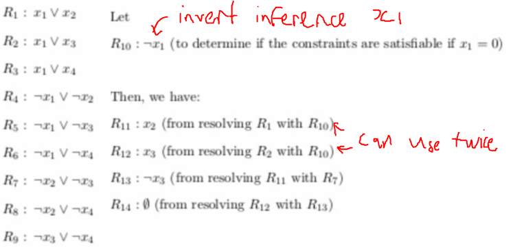

## AI: definitions

1. percepts: input, e.g. what is seen
2. sensors: receive/parse input
3. functions: process input, produce execution steps
4. actuators: performs actions
5. actions: output
env --percepts→ sensors > functions > actuators --actions→ env (agents = sensors + functions + actuators)
Rational agent: Given [percept sequence, prior knowledge, set of actions, performance measure], optimises performance measure

**Agent function**: P, percept sequence --agent function f→ action A

Environment properties:

1. fully observable(can see entire board) vs partially observable(can only see part of board)
2. deterministic(same actions same outcome) vs stochastic(gamba)
3. episodic(next action will not affect future choices, **can plan**) vs sequential(next action e.g. pacman move character, will affect future decisions)
   1. If we can plan, e.g. produce sequence of actions (then execute sequentially e.g. sudoku), considered episodic.
4. Discrete(fixed set of states possible) vs continuous (infinite number of states possible)
5. Single agent (play with urself) vs Multi agent(against another player/AI)
6. Known (know mechanics, performance metrics etc) vs Unknown (black box)
7. Static vs Dynamic(Environment changes while agent is deciding on action)

Types of agents:

1. Reflex agent: **directly maps** percepts to actions (e.g. if at 0,0 go left; if at 0,1 go up; ...)
2. Model based reflex action: generalizes percepts into models (e.g. groups similar situations into same case, produce action)
3. Goal based agent: given state and actions, definition of goal, tries to satisfy goal
4. Utility based agent: like goal, but **optimizes** utility, e.g. chess, takes best move (more complex than goal, need to understand utility not just goal)

Search space definition

1. State representation si: data describing instance i of the environment, e.g. current position, walls etc.
2. Goal test: `isGoal(si) => boolean`
3. Actions: `actions(si) => Action[]`, possible actions at state i
4. Action costs: `cost(si, aj, sk) => number`, cost of taking an action `aj` to transition `si` to `sk`, generally >= 0.
5. Transition model: `T(si, aj) => sk`, result of executing `aj` at `si`.
summarized as a graph problem, can find traversal start state to end state

### General search algorithm

**Uninformed search**:

```js
const frontier = state.edges
while (frontier) {
  const current = frontier.pop()
  if(isGoal(current.state)) return current.getpath()
  for a in actions(current.state) frontier.push(Node(T(state.current, a)))
}
```

- Node = `state` + `parent` + `actions` + `cost` + `depth`. e.g. current path A -> B -> C, `Node(C, parent = [A, B], action = 'moveup', ...)`.
- uninformed search = no domain knowledge beyond search problem formulation
- typical uninformed search algo differ in frontier data struct: BFS = queue, Uniform Cost search = prio queue, Depth first = stack etc.
- Correctness: algorithm is **Complete** if solution will be found when one exists, raise error if no solution found. **Optimal** = find solution with lowest cost
- by default **late goal test** (test goal on neighbours before adding to frontier) except for BFS
Breadth First Search (default **early goal test**):

1. Queue frontier
2. `O(b^d)` time/space complexity: b = branching factor, how many branch; d = depth of tree
3. "*Complete*" (on condition: finite branching factor && (finite search space OR has a solution)), Subobtimal (no concern about cost)
4. Can be improved using Early goal test (test before push) instead of Late goal test (original) → saves `b^k+1` where k is the depth of the goal

Uniform Cost Search (Djisktra, late goal)

1. Queue = prio queue w/ cost prio
2. Time/Space complexity `O(b^e)` where `e`=`1 + floor(Optimal path cost C / k)`, `k` is a small positive constant
3. "*Complete*"(on same BFS condition), optimal (late goal) → early goal may not be optimal w/ graph search

Depth First Search, late goal:

1. Time complexity `O(b^m)`, space = `O(bm)`, `m` == max depth → `bm` because at max space req = max depth b*m no. of nodes in stack
2. Incomplete under BFS condition: if infinite search space, aka depth, dfs continue forever
3. subotimal
4. Can be improved by backtracking instead of each node storing entire path back to node. `O(m)` space
5. **NOTE**: pop in reverse order due to stack: `pop A push B push C, pop C, pop B`.

Depth limited/Iterative deepening, late goal

1. Depth limited = DFS with depth limit `l`, only search up to `l` depth, no actions at `l` depth
2. Depth limited same guarantees as DFS
3. Iterative deepening: increase depth limit by 1 each time until solution found
4. Iterative deepening guarantees completeness under BFS conditions, but with space complexity of dfs `O(bm)`. repeated calculation of smaller depths overhead ~11%, insignificant

Trees vs graphs

1. v1: (before pushing to frontier) `if child not in reached: frontier.push(child) && reached[child.state] = child`;
2. v2: (before pushing to frontier) `if child not in reached or child.cost < reached[child.state].cost: frontier.push(child) && reached[child.state] = child`;
3. v3: when exploring `node`: `reached[node.state] = node`; before push: `if child not in reached: frontier.push(child)`; (like "late reaching")

- Graphs can have cycles; to prevent revisits, can add visited hashmap (`Graph search v1`), check map before pushing adjacent nodes; `Graph search v2`: if revisit has lower cost update cost and add to frontier (revisit it)
- Graph search **default graph search v1**, all BFS UCS DFS DLS IDS space time `O(|V| + |E|)`, no check cheaper path

**Informed search**:

General Best First Algo:

```py
while len(frontier) > 0:
  node = frontier.pop()
  if is_goal(node.state): # late goal test
    return node
  # graph search v2
  for child in [Node(state=apply(node.state, action), parent=node, cost=node.cost + action.cost) for action in problem.actions]:
    if child.state in reached or child.cost < reached[child.state].cost:
      reached[child.state] = child
      frontier.append(child)
```

Greedy Best First Search:

1. UCS except prio determined by `h(n)` heuristic: distance from `g`.
2. sub optimal: when adding child nodes to frontier, does not consider distance from parent to child, only sorted by distance child to goal
3. (tree search) incomplete: if A → B and B → A, both A/B same h, can end up going back and forth b/w A and B
4. (graph search) complete if finite state space: will visit entire space

A* search:

1. Greedy Best First + account for alr incurred costs
2. `f(n) = g(n) + h(n)` → `g(n)` = actual path cost, `h(n)` = estimated cheapest path to G; `h(n)` gets more accurate the closer it is to G
3. completeness, same criteria as ucs
4. optimality: optimal if `h(n)` is admissible (tree, graph v2 late goal); early goal/ graph v1 may skip optimal
5. if `h(n)` consistent, graph search optimal by v3 (v3 fixes v1 → v1 cannot add more than 1 path to G since G marked as reached too early)
6. note: if `h1(n) >= h2(n)`, then `h1` *dominates* `h2`, aka `h1` more efficient, higher accuracy, need to try fewer paths (assuming both admissible)

**admissible heuristics**:

- `h(n)` considered admissible if it never overestimates cost (to goal): `h(n) <= h*(n)`, paths ending at goal exact, paths not ending at goal overestimated
- e.g. euclidean `sqrt(a^2 + b^2)` always underestimates

**consistent heuristics**:

- requirement: `h(parent) <= h(child) + cost(parent, child)`, so `f` costs can be monotonically increasing
- if consistent, then also admissible

**Effective branching factor**

- More efficient heuristics, less number of paths with cost <= optimal path, less nodes explored
- can be evaluated with estimated branching factor: N nodes explored, solution at d depth, find b s.t. `N + 1 = (b^(d + 1) - 1) / (b - 1)`, compare b
- derived from `N + 1 = sum(b^i)[1 → d]` → Gp formula `(ar^n - 1)/(r - 1)`, `a` = `b`, `n` = `d`.

Relaxing problems: to generate a heuristic for a problem, sometimes we can simplify the problem, e.g. path finding, every cost is 1

## Gradient descent

- local search: greedy approach, maintain best successor. good for large/infinite search spaces, but might not guarantee goal: **define as local search = (initial state, finding next state, termination (when to loop, when end))**
- hill climb algorithm

```py
while True: # like f(n) = -h(n)
  neighbour = max(current.successors) # steepest hill/ greedy
  if value(neighbour) <= value(current):
    return current
  current = neighbour
  if is_goal(current):
    return current
```

- complete state formulation: **each state is a potential "solution"**. either guess and check neighbours or move to states with higher value `f(n) = -h(n)`.
  - good for problems where "path" to goal not important
  - `-h(n)` simply to satisfy hill climb name, otherwise `h(n)` descending, lower better
- sideways move: instead of `neighbour < current` use `neighbour <= current`, so can traverse plateaus
- stochastic hill climb: choose randomly among states better than current (not just best). takes longer, but may find better solution (Stochastic gradient descent = pick random sets of training data for each iteration of learning in ML)
- First choice hill climb: when too many successors, randomly generate successor until 1 better value (instead of generate all)
- random restart: add outer loop to pick a new random starting state, reset until found
  - expected number of steps: `x + (1-p)/p*y`, `x`=E(steps to find actual goal), `y`=E(steps to find local maxima), `p`=probability to find global maxima, `(1-p)/p` = E(no. failures)
- local beam search: store k states instead of current state, each iteration generate successors for all k, repeat for best k (or random out of better a la stochastic hill climb). goal test for each k after selecting k
- Note that hill climb may not give optimal (global minima: best possible state, does not need to be goal if goal impossible), may land in local minima instead.

## Constraint satisfaction Problems

- systematic approach, do not search states where constraint not satisfied. prune invalid subtrees
- Only consider urbary/binary constraints, ignore global constraints unless its CSP formulation question
- constraints can be dynamic, e.g. simultaneous equations, each eqn = constraint
  - notation: `<(scope), rel>`: e.g. `<(x1, x2), x1 > x2>`. |scope|, single = urnary, double = binary, >2 global
  - hypergraphs: link variables (circles/vertexes) via relationships (edges). linking vertex (box) can also be used to join global constraints

```py
# CSP (DFS) general algorithm
while is_incomplete(assignments):
  try: # if nothing to assign return failure
    current = assign_to_non_assigned(current)
    if current.consistent():
      assignments.push(current)
  except:
    return failure
return assignments
```

- use DFS traverse. keep assigning until fail
- can backtrack if fail (like DFS) (or look ahead check if fail before assigning)
- state representation: initial state all variable unassigned. domain = possible values, variables = stuff that need to be assigned a value
- action: assign values to variables. no costs/evaluation function used
- goal test: all constraintes satisfied
- CSP search tree leaves = `n!m^n` → first level nm leaf states, subtree of each = (n-1)*m, (n-2)m ...

```py
def backtrack(csp, assignment):
  if assignment.complete():
    return assignment
  var = select_unassigned_var(csp, assignment)
  for value in domain.sort(get_value_sorter(csp, assignment, var)):
    if consistent(value, var, assignment):
      assign(value, var, assignment)
      if infer(assignment) != failure:
        csp.append(infer(assignment))
        result = backtrack(csp, assignment)
        if result != failure:
          return result
        unassign(value, var, assignment) # backtrack
  return failure
```

- constraint graph: simple vertex, circle: variable, linking vertex, square: global constraints, edge: links variables in scope of constraint
  - urnary constraints = node itself, binary constraint = edge
- variable order heuristics: (`select_unassigned_var`)
  1. Minimum Remaining values (MRV): Choose variable with fewest consistent values (e.g. map colouring, area on map with fewest possible colours) → finds inconsistent subtree fast, prunes them
  2. Degree heuristic: used for tie breaking stuff like MRV. Select variable w/ most constraints among unassigned variables (e.g. map colouring, area adjacent to most other areas)
- value order heuristics: (`get_value_sorter`)
  1. Least Constraining value (LCV): after choosing a variable, choose value that rules out the fewest subsequent choices (maximize subsequent choices, prioritize flexibility of subsequent assignments)

- inferences `infer(assignment)`:
  - forward checking: check remaining legal values for unassigned variables, terminate if any has no legal values (does not provide early detection for all failures, only 1 step ahead)
  - constraint propagation: solves forward checking flaws, traverses entire constraint graph to make sure still consistent (note global constraints can be converted to binary from invisible node to all vertexes)
    - node consistent: urnary constraints satisfied (vertexes) **urnary constraint checked as preprocessing before backtracking algo**
    - arc consistent: binary constraints satisfied (edges). variable Xi is arc consistent wrt Xj iff for all values Di there exists some value Dj that satisfies binary constraint. Note arc == directed, binary constraint = 2 arcs
- AC3 step-through:[example: ABC member [1, 4]] constraint A to B (2A = B), domain A reduced to {1,2} **ignore B domain**; constraint B to A (2A = B), domain B reduced to {2,4}; ...

```py
def arc_consistent(csp): #aka AC-3 Algo O(n^2 d^3), d = domain size
  arcs = csp.get_arcs()
  while not arcs.empty():
    arc = arcs.pop()

    # revise domains
    revised = False
    for x in arc.x_i.domain:
      # no value in Xj domain can satisfy constraint with x across arc
      if not can_satisfy_constraint(csp, x, arc.x_j.domain):
        # x cannot be used in arc, does not satisfy constraint
        delete(x)
        revised = True
    
    if revised:
      if len(arc.x_i.domain) < 1:
        return false
      for neighbour in arc.x_i.neighbours:
        arcs.append((neighbour, x_i)) # neighbour → xi, see if neighbour still ok
  return True
```

### Adversarial search (lecture 8)

State formulation: `TO-MOVE(s)` (determine whos move next), `ACTION(s)` (legal actions on move), `RESULT(s, a)` (Transition w/ action `a`), `IS-TERMINAL(s)` (anyone won?), `UTILITY(s,p)` (final value to player p when game ends at state `s`, e.g. 1 for win -1 for loss)

- `winning strategy`: any strategy by player 2, player 1 will win (exclude draw, with draw = `non-losing strategy`)

**Minimax Algorithm**: MAX player maximise minimum payoff, MIN player minimize maximum payoff

- Complete (finite game tree), Optimal, O(b ^ m) time, O(bm) space
**Alpha-Beta Pruning**:
- alpha, 𝛼 = upper bound of values (relative to MAX player)
- beta, 𝛽 = lower bound of values
- pruning: given MIN node `n`(player at `n` wants to minimize payoff), stop searching below `n` if Some MAX ancestor i `𝛼(i) >= 𝛽(n)`: ancestor will not traverse n anyways
  - tldr: if parent of current MAX node C is MIN player(𝛽), lower bound of 10 found already. current node MAX C encounter child 12, can prune all other children since 𝛽 will not choose C.
- pruning never affects final outcome. time complexity O(b ^ m/2) perfect ordering pruning, O(b ^ 3m/4) random ordering.
- Heuristic minimax: Naive minimax need traverse to the end to determine utility (1 = win -1 = lose etc.), estimate with heuristic so no need go to end
- Cutting off search: replace `Is-Terminal` with `Cutoff-Test(s, d)` (`d` = depth for depth limit search; alternatively use iterative deepening search), `Utility(s,p)` w/ `Eval(s,p)`.
- Stochastic games: games with probability. calculate expected value of a state instead.



### Knowledge based agents

- generalised knowledge representations. Make inference on existing info to get new info, states similar to CSPs, assign values to variables
- 2 kinds: Knowledge based (Domain specific content), Inference Engine (Domain independent algorithms)
- sentence: `x + 2y >= z`, must be valid arithmetic
  - valid if true for all possible truth value assignments, e.g. A V ~A. satisfiable if have some truth value that makes it true. Unsatisfiable otherwise
- Knowledge Base: (rules + percepts) → {KB} = models that satisfy what had been perceived (e.g. 1,1 is breeze) + game rules (1,2 or 2,2 must be pit)
  - **model** `v` models `𝛼` if `𝛼` is true under `v` → like a (known part of) state where `𝛼` is true (e.g. 𝛼 == (1,2) is safe, v = state where (1,2) is safe)
  - entailment: 𝛼 ⊨ 𝛽 (𝛼 entails 𝛽) → 𝑀(𝛼) is subset 𝑀(𝛽), where 𝑀(𝛼) == all models for 𝛼. (e.g. 𝛼 == is prime, 𝛽 == is odd)
  - should infer safe only when {KB} entails 𝛼, e.g. remaining possible states all say 1,2 is safe

  ```py
  time = 0
  def run(percept, knowledge_base):
    knowledge_base.record(percept.to_sentence(time))
    action = knowledge_base.infer_next_action(time)
    knowledge_base.record(action.execute())
    time += 1
    return action
  ```

  - Soundness: KB ⊢𝒜 𝛼, 𝛼 is infered from KB using algo 𝒜, 𝒜 is sound if KB ⊢𝒜 𝛼 implies KB ⊨ 𝛼 (only infer when safe, aka correct)
  - Completeness: if KB ⊨ 𝛼 then KB ⊢𝒜 𝛼, 𝒜 can infer any sentence KB entails (aka fully infered)

### Truth Table Enumeration

- KB is true iff percepts + rules satisfied
  - percept: 1,1 is clear → Pit(1,1) must be false, Breeze(1,1) must be false
  - infer: 1,1 is clear → Pit(1,2) must be false, Pit(2,1) must be false
  - When all KB percepts/inferences satisfied, KB = True. If for all 𝛼 = True then KB = True, 𝛼 entails KB
  - all models where above is satisfied, KB == true

```py
# KnowledgeB: knowledge base, sentence; alpha: query, sentence; symbols: symbols in KB + alpha
def check(KnowledgeB, alpha, symbols, model):
  if len(symbols) == 0:
    if verify_logic(KnowledgeB, symbols): #check propositional logic is valid
      return verify_logic(alpha, symbols) #if KB is true then alpha must be true also to entail
    return True #if KB is alr false, alpha doesnt matter, alpha can be KB + others
  else:
    # enumerate all 2^k possible models DFS
    return check(KnowledgeB, alpha, symbols EXCEPT symbols[0], model UNION {symbols[0] = True})
      and check(KnowledgeB, alpha, symbols EXCEPT symbols[0], model UNION {symbols[0] = False})

# O(2^n) time, O(n) space (DFS depth n), guarantees soundness (entails KB), completeness (all possible)
def entails(KnowledgeB, alpha):
  return check(KnowledgeB, alpha, symbols, {})
```

### Conjunctive Normal Form CNF

- many or's joined with and's: (x1 or x2) and (y1 or x1) and (z1 or x1 or x2)
- Resolution: if x1 is in R1 and ~x1 is in R2, where CNF KB = R1 and R2 and ..., can remove x1 from both:
  - KB = (x1 or y1 ...) and (~x1 or z1 ...), then resolvent = (y1 or ... or z1 or ...)
  - if x1, then (z1 ...) must hold. if ~x1 then (y1 ...) must hold
- CNF conversion rules:
  - A <-> B == (A -> B) and (B -> A)
  - A -> B == ~A or B
  - ~(A or B) == ~A and ~B, ~(~A) = A etc.
  - A or (B and C) == (A or B) and (A or C)



```py
new = {}
while True:
  for clause1, clause2 in (clauses X clauses):
    resolvents = resolve(clause1, clause2)
    if None in resolvents:
      return True
    new += resolvents
  if new subset clauses:
    return False
  clauses += new
```

`clauses` = KB in CNF + **~𝛼** (𝛼 == query to KB, is xy safe?). keep resolving clause pairs (merge them) until empty clause found `x and ~x → {}` (if found then can infer 𝛼: KB and ~𝛼 unsatisfiable), or no more resolutions (cannot infer 𝛼)
**NOTE**: clause can be used multiple times i.e. resolve 1 with 3, resolve 2 with 3.



### Probability

- bayes rule: P(A | B) = P(B|A) * P(A) / P(B). Also = P(A and B) / P(B)
- chain rule: P(A n B n C) = P(A | B n C) *P(B n C) = P(A | B n C)* P(B) * P(C)
- independence: P(A | B) == P(A). P(A n B) == P(A) * P(B)
- bayesian inference: infer P(𝛼 | KB(CNF))
- joint distribution table: e.g. rows = cavity, columns = toothache
- note: n different variables with domain size d, table size = d^n. if all independent = dn

### Conditional independence

- P(ART | covid+) independent of P(PCR | covid+) even though P(ART | PCR) not independent.
- P(R1 and R2 and ... C) = P(R1 | C) *P(R2 | C)* P(C) [w/ chain rule], suppose C = conditional
- P(Cause | Effect) = P(Effect | Cause) *P(Cause) / P(Effect) = k* P(Cause) *P(Effect1 | Cause)* P(Effect2 | Cause) ...
  - P(Effect) is constant across all (Cause | Effect) since Effect given, want to find which cause
  - Table stores each P(Effect_i | Cause), P(Cause)

### Bayesian network

- simplest case, can use conditional probability table ^^
- network graph, A → B, A causes effect B. can many to many, A → B, C → B, B → X, B → Y
- if each variable k parents, domain size m, network representation needs O(n * m ^ k) values since each variable needs m^k rows
- if variables are boolean, k parents, 2^k. parents = dependencies.
- if we know x1 = True, can just use P(y | x1) directly, e.g.:
  - P(x1 & ~x2 & x3 & x4) = P(x1 | ~x2) *P(~x2 | x3 & x4)* P(x3 | x4) *P(x4 | a)* P(a)
  - note that whatever is outside, e.g. a, must multiply in
