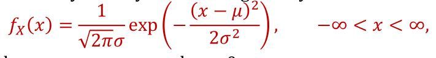

# ST2334 AY21/22 S1

## CH 2 Random var

Probability Density Function:

- probability function f(x), Pr a < x < b === integrate(f(x))ab

Cumulative Distribution Function:

- F(x) = P(X \<= x);
- x = 4, F(x) = probability x \<= 4
- integrate -inf to x

Expected value/mean:

- probability \* value sum
- integrate infinity x\*f(x) dx
- if g applied to x, i.e. g(X), then use g(x)\*f(x) instead

Variance:

- average(discrete)/integrate infinity(continuous): (x - mean)^2 \* f(x)

Standard Deviation:

- root of variance

Chebyshev's inequality:

- probability that: _|x - mean| >= k _ std dev\* is \<= 1/k^2

## Two dimensional probability

Dependent:

- probability dependent on 2 dependent variables
- probability density function, sum/integrate twice wrt x/y

Independent:

- f(x, y) = f(x) \* f(y)

## Special probability distributions

1. Discrete uniform distribution
   random variable X, all values x1 ... xn equal probability
   mean = 1/k \* sum(x)
   variance = 1/k sum((x - mean)^2)
2. Bernoulli distribution
   2 outcomes, pass/fail.
   mean = probability of (pass)
   variance = p\*(1-p)
3. Binomial distribution
   P(X = x) = nCx _ p^2 _ (p')^(n - x)
   i.e. test 75% chance succeed, P(X = x) is probability x number of tests succeed in n independent tests
   mean = np
   variance = np(p')
4. Poisson distribution
   Number of successes occuring in a time interval are independent of successes outside the time interval
   probability of success increases proportional to time interval
   e.g. average robberies in a day
   P(X = x) = (_e_^-lambda \* lambda^x) / factorial(x), lambda = average number of successes in the given interval
   mean, Expected(X) = lambda
   Variance(X) = lambda

```
avg robberies/day = 4
probability 6 robberies in 2 days:
P(6) = e^-8 * 8^6 / factorial(6) = 0.122
```

_Poisson approximation of binomial distribution_
binomial with n,p:

suppose as n -> infinity and **p -> 0**: lambda = np constant (invert success/failure if p very high)
Then Xis approximately poisson distribution with lambda = np

```
p of car accident = 0.001
if 1000 cars pass per day what is P(2+ accidents) in a day:

using above: lambda = np = 1
P(X >= 2) = 1 - P(0) - P(1)
approx 1 - e^-1 - e^-1

```

5. Continuous random distribution
   pass/fail type, pass within a range, fail outside
   rectangular pdf curve, between a and b equally uniform dist, outside 0 probability
   E(X) = (a + b) / 2, Variance: (b - a)^2 / 12
6. Exponential distribution
   probability function f(x) = a*e* ^ -ax for x > 0
   E(X) = 1/a, V(X) = 1/a^2 _can reverse to find a given average_
   **Exponential has NO MEMORY**
   P(X > s + t | X > s) = P(X > t), i.e. if lightbulb lasted s years, probability it will last t more years = P(t)
7. Normal distribution
   
   𝐸(𝑋) = 𝜇, 𝑉(𝑋) = 𝜎^2
   **standardizing:**
   Z = (X - 𝜇) / 𝜎, N(0,1) dist with E(Z) = 0, V(Z) = 1.

```
X ~ N(50, 100), find P(45<X<60):
P((45-50)/10 < Z < (60-50)/10)
P(-0.5 < Z < 1.2)
can be computed online/gc
```

**Normal approximation of binomial**
as n -> infinity and p -> 0.5, can use normal approx. TLDR, np > 5 and n(1-p) > 5

```
Z = (X - np)/ sqrt(np * p')
```
